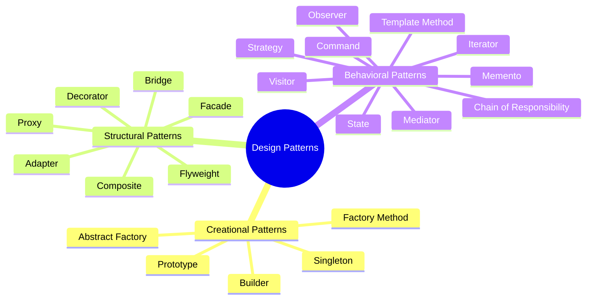

# Tổng Quan về Design Patterns (Mẫu Thiết Kế)

Chào mừng bạn đến với tài liệu hướng dẫn về **Design Patterns (Mẫu Thiết Kế)** dựa trên kiến thức từ hệ thống nổi tiếng [Refactoring Guru](https://refactoring.guru/design-patterns). 

Tài liệu này được biên soạn bằng tiếng Việt với mong muốn cung cấp cái nhìn tổng quan, dễ hiểu nhất kèm theo các ví dụ mã nguồn thực tế viết bằng **TypeScript**.

---

## 1. Design Pattern là gì?

**Design Pattern (Mẫu Thiết Kế)** là các giải pháp đã được chứng minh hiệu quả và được tối ưu hóa để giải quyết các vấn đề phổ biến thường gặp trong thiết kế phần mềm hướng đối tượng (OOP).

Chúng không phải là các đoạn mã cụ thể có thể sao chép và dán trực tiếp vào chương trình của bạn, mà là một **khái niệm/bản thiết kế (blueprint)** giúp bạn giải quyết một vấn đề cụ thể theo cách tối ưu nhất.

### Một Design Pattern thường bao gồm:
*   **Ý định (Intent / Purpose):** Vấn đề mà mẫu thiết kế này muốn giải quyết và mục đích của nó.
*   **Đặt vấn đề (Motivation / Problem):** Tình huống giả định chi tiết chỉ ra tại sao chúng ta cần mẫu thiết kế này.
*   **Giải pháp (Solution):** Cách tổ chức các lớp (classes) và đối tượng (objects) để giải quyết vấn đề đó.
*   **Sơ đồ cấu trúc (Structure):** Sơ đồ quan hệ giữa các thành phần (thường biểu diễn bằng UML).
*   **Ví dụ Code (Code Example):** Minh họa cách hiện thực hóa mẫu thiết kế bằng một ngôn ngữ lập trình cụ thể.

---

## 2. Lịch sử ra đời

Khái niệm Design Pattern ban đầu được đề xuất bởi kiến trúc sư xây dựng **Christopher Alexander** vào năm 1977 để giải quyết các vấn đề trong quy hoạch đô thị và kiến trúc nhà ở.

Năm 1994, bốn tác giả Erich Gamma, Richard Helm, Ralph Johnson, và John Vlissides (thường được gọi là nhóm **Gang of Four - GoF**) đã phát hành cuốn sách kinh điển *"Design Patterns: Elements of Reusable Object-Oriented Software"*. Họ đã áp dụng ý tưởng này vào khoa học máy tính và giới thiệu **23 mẫu thiết kế** nền tảng vẫn được áp dụng rộng rãi cho đến ngày nay.

---

## 3. Tại sao nên học Design Patterns?

1.  **Không cần "tái phát minh bánh xe"**: Giúp bạn giải quyết các vấn đề thiết kế bằng cách sử dụng các giải pháp đã được kiểm nghiệm thực tế qua hàng thập kỷ.
2.  **Ngôn ngữ chung của Lập trình viên**: Giúp giao tiếp kỹ thuật giữa các thành viên trong đội phát triển trở nên hiệu quả hơn. Thay vì giải thích dài dòng cách tổ chức các Class, bạn chỉ cần nói: *"Chỗ này mình dùng Singleton"* hoặc *"Áp dụng Strategy Pattern nhé"*.
3.  **Tăng khả năng mở rộng & Bảo trì (Maintainability & Scalability)**: Giúp mã nguồn tuân thủ các nguyên lý thiết kế sạch, đặc biệt là **SOLID**.

---

## 4. Phân loại 3 nhóm Design Patterns chính

Hệ thống Design Patterns được chia làm 3 nhóm chính dựa trên mục đích sử dụng của chúng:

### 4.1. Nhóm Mẫu Khởi Tạo (Creational Patterns)
Nhóm này tập trung vào các giải pháp **khởi tạo đối tượng (object creation)**. Chúng giúp che giấu logic khởi tạo phức tạp và kiểm soát cách đối tượng được tạo ra thay vì khởi tạo trực tiếp bằng toán tử `new`.
*   [Chi tiết các mẫu khởi tạo trong creational_patterns.md](file:///Users/kaiser/code/learn/design-parttern/creational_patterns.md)

### 4.2. Nhóm Mẫu Cấu Trúc (Structural Patterns)
Nhóm này tập trung vào **cấu trúc và mối quan hệ giữa các lớp/đối tượng**. Chúng giúp kết hợp các đối tượng độc lập thành một cấu trúc lớn hơn, linh hoạt hơn mà không làm thay đổi các lớp gốc.
*   [Chi tiết các mẫu cấu trúc trong structural_patterns.md](file:///Users/kaiser/code/learn/design-parttern/structural_patterns.md)

### 4.3. Nhóm Mẫu Hành Vi (Behavioral Patterns)
Nhóm này tập trung vào **sự tương tác và phân chia trách nhiệm giữa các đối tượng**. Chúng giúp các đối tượng giao tiếp với nhau hiệu quả và lỏng lẻo hơn (loose coupling).
*   [Chi tiết các mẫu hành vi trong behavioral_patterns.md](file:///Users/kaiser/code/learn/design-parttern/behavioral_patterns.md)

---

## 5. Mục lục & Liên kết nhanh

Dưới đây là danh sách chi tiết của tất cả 22 mẫu thiết kế được đề cập trong tài liệu này:

| Nhóm Mẫu Thiết Kế | Tên Pattern (Tiếng Anh) | Tóm tắt ý nghĩa chính |
| :--- | :--- | :--- |
| **Khởi Tạo (Creational)** | [Factory Method](file:///Users/kaiser/code/learn/design-parttern/creational_patterns.md#1-factory-method) | Cung cấp interface để tạo đối tượng ở lớp cha, nhưng cho phép lớp con quyết định loại đối tượng nào sẽ được tạo. |
| | [Abstract Factory](file:///Users/kaiser/code/learn/design-parttern/creational_patterns.md#2-abstract-factory) | Tạo ra một tập hợp các đối tượng liên quan với nhau mà không cần chỉ rõ các lớp cụ thể của chúng. |
| | [Builder](file:///Users/kaiser/code/learn/design-parttern/creational_patterns.md#3-builder) | Cho phép xây dựng các đối tượng phức tạp theo từng bước một. |
| | [Prototype](file:///Users/kaiser/code/learn/design-parttern/creational_patterns.md#4-prototype) | Cho phép sao chép các đối tượng hiện có mà không làm cho code bị phụ thuộc vào các lớp của chúng. |
| | [Singleton](file:///Users/kaiser/code/learn/design-parttern/creational_patterns.md#5-singleton) | Đảm bảo một lớp chỉ có duy nhất một thực thể (instance) và cung cấp một điểm truy cập toàn cục cho thực thể đó. |
| **Cấu Trúc (Structural)** | [Adapter](file:///Users/kaiser/code/learn/design-parttern/structural_patterns.md#1-adapter) | Cho phép các đối tượng có giao diện không tương thích hợp tác hoạt động với nhau. |
| | [Bridge](file:///Users/kaiser/code/learn/design-parttern/structural_patterns.md#2-bridge) | Tách biệt một abstraction lớp lớn thành hai phân cấp độc lập (Abstraction và Implementation) để phát triển riêng biệt. |
| | [Composite](file:///Users/kaiser/code/learn/design-parttern/structural_patterns.md#3-composite) | Cho phép bạn cấu trúc các đối tượng thành dạng cây để đại diện cho cấu trúc phân cấp một phần hoặc toàn bộ. |
| | [Decorator](file:///Users/kaiser/code/learn/design-parttern/structural_patterns.md#4-decorator) | Cho phép gán thêm các hành vi mới cho đối tượng một cách động bằng cách đặt đối tượng đó bên trong các đối tượng wrapper. |
| | [Facade](file:///Users/kaiser/code/learn/design-parttern/structural_patterns.md#5-facade) | Cung cấp một giao diện đơn giản hóa cho một hệ thống phức tạp các lớp, thư viện hoặc framework. |
| | [Flyweight](file:///Users/kaiser/code/learn/design-parttern/structural_patterns.md#6-flyweight) | Giúp tiết kiệm RAM bằng cách chia sẻ trạng thái chung giữa nhiều đối tượng thay vì giữ tất cả dữ liệu ở mỗi đối tượng. |
| | [Proxy](file:///Users/kaiser/code/learn/design-parttern/structural_patterns.md#7-proxy) | Cung cấp một đối tượng thay thế hoặc giữ chỗ cho một đối tượng khác để kiểm soát quyền truy cập vào nó. |
| **Hành Vi (Behavioral)** | [Chain of Responsibility](file:///Users/kaiser/code/learn/design-parttern/behavioral_patterns.md#1-chain-of-responsibility) | Cho phép truyền các yêu cầu dọc theo một chuỗi các handler để xử lý. |
| | [Command](file:///Users/kaiser/code/learn/design-parttern/behavioral_patterns.md#2-command) | Chuyển đổi một yêu cầu thành một đối tượng độc lập chứa tất cả thông tin về yêu cầu đó. |
| | [Iterator](file:///Users/kaiser/code/learn/design-parttern/behavioral_patterns.md#3-iterator) | Cho phép duyệt qua các phần tử của một tập hợp mà không cần để lộ cấu trúc bên dưới của nó. |
| | [Mediator](file:///Users/kaiser/code/learn/design-parttern/behavioral_patterns.md#4-mediator) | Giảm thiểu các phụ thuộc hỗn loạn giữa các đối tượng bằng cách buộc chúng giao tiếp gián tiếp qua một đối tượng trung gian. |
| | [Memento](file:///Users/kaiser/code/learn/design-parttern/behavioral_patterns.md#5-memento) | Cho phép lưu và khôi phục trạng thái trước đó của một đối tượng mà không để lộ chi tiết cấu trúc bên trong. |
| | [Observer](file:///Users/kaiser/code/learn/design-parttern/behavioral_patterns.md#6-observer) | Định nghĩa cơ chế đăng ký để thông báo cho nhiều đối tượng về bất kỳ sự kiện nào xảy ra với đối tượng mà chúng đang theo dõi. |
| | [State](file:///Users/kaiser/code/learn/design-parttern/behavioral_patterns.md#7-state) | Cho phép một đối tượng thay đổi hành vi khi trạng thái nội bộ của nó thay đổi. Đối tượng sẽ trông như thể thay đổi class của nó. |
| | [Strategy](file:///Users/kaiser/code/learn/design-parttern/behavioral_patterns.md#8-strategy) | Định nghĩa một tập hợp các thuật toán, đóng gói từng thuật toán và làm cho chúng có thể hoán đổi cho nhau. |
| | [Template Method](file:///Users/kaiser/code/learn/design-parttern/behavioral_patterns.md#9-template-method) | Định nghĩa khung của một thuật toán ở lớp cha nhưng cho phép các lớp con ghi đè các bước cụ thể mà không làm thay đổi cấu trúc thuật toán. |
| | [Visitor](file:///Users/kaiser/code/learn/design-parttern/behavioral_patterns.md#10-visitor) | Cho phép tách các thuật toán khỏi các đối tượng mà chúng hoạt động trên đó. |

---

## 6. Lưu ý quan trọng khi học Design Patterns

*   **Tránh bẫy Over-engineering (Phức tạp hóa vấn đề)**: Đây là lỗi phổ biến nhất của người mới học. Họ cố gắng áp dụng design patterns vào mọi ngóc ngách ngay cả khi một đoạn mã đơn giản (KISS - Keep It Simple, Stupid) đã giải quyết tốt vấn đề. Chỉ áp dụng pattern khi vấn đề thực tế xuất hiện hoặc được dự báo rất rõ ràng.
*   **Hiểu bản chất thay vì học vẹt**: Đừng cố nhớ chính xác cấu trúc class của từng pattern. Hãy tập trung vào việc hiểu **Vấn đề cần giải quyết là gì?** và **Tư tưởng cốt lõi của pattern đó là gì?**. Khi hiểu bản chất, bạn có thể tự biến tấu pattern cho phù hợp với dự án của mình.
