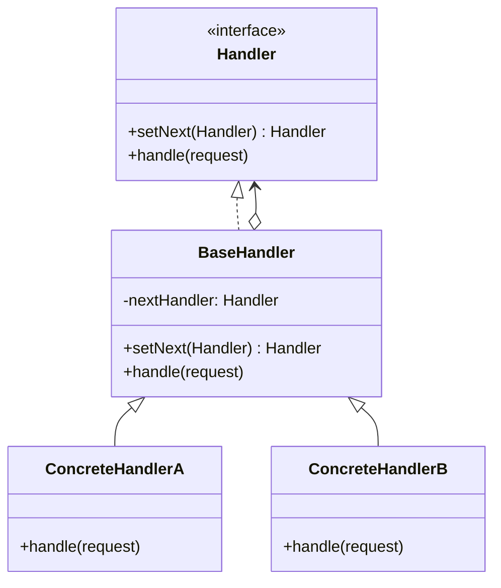
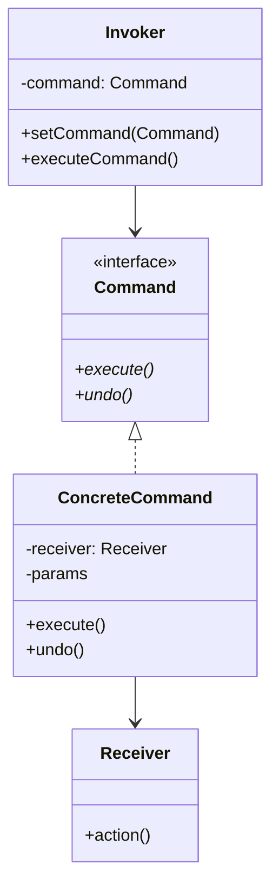
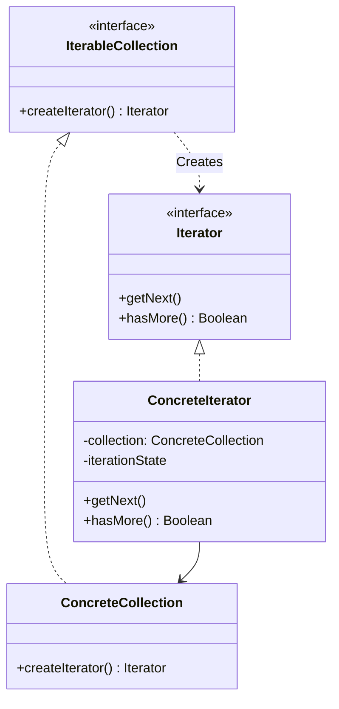
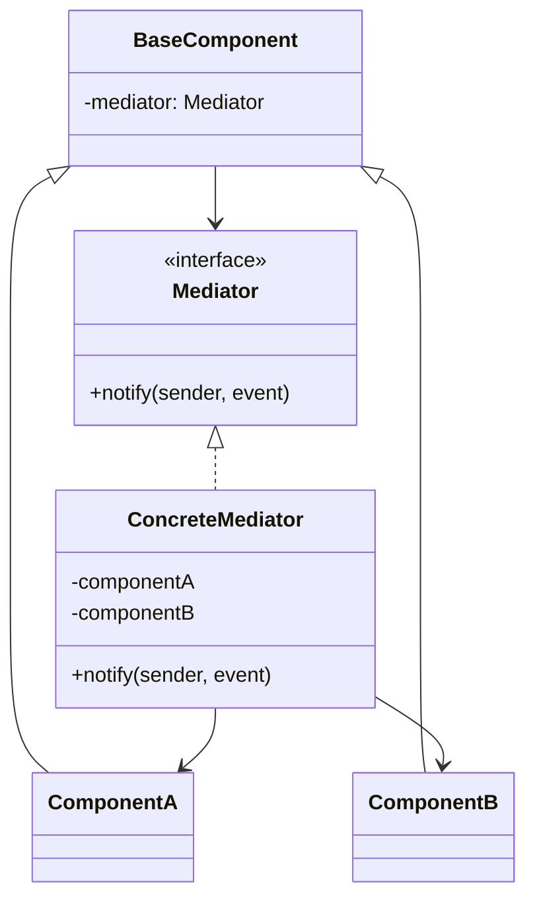
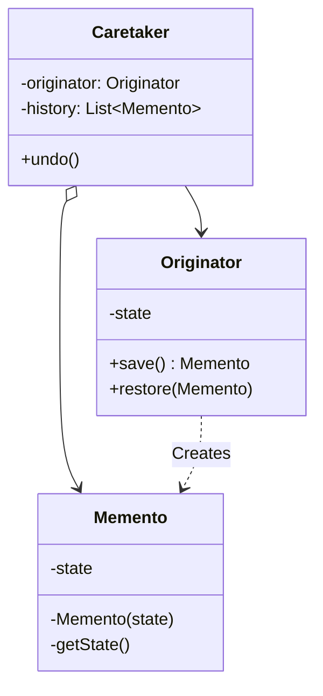
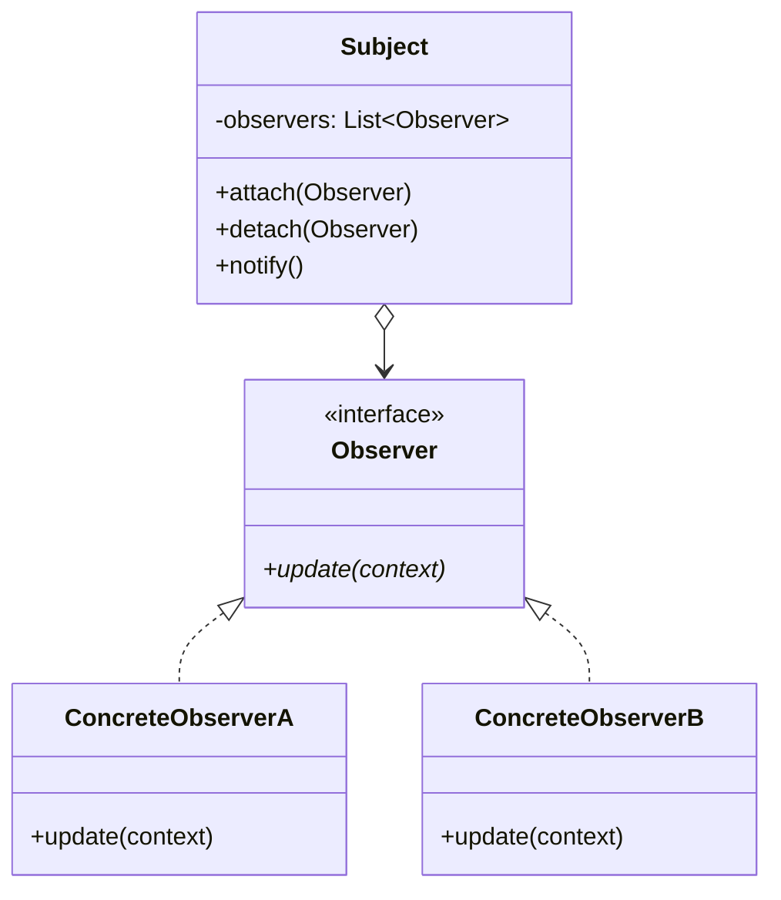
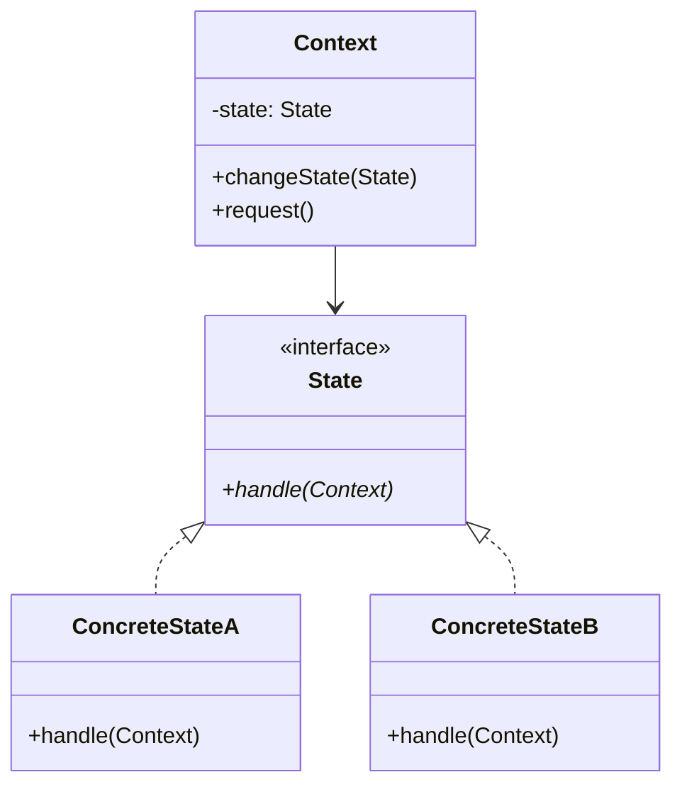
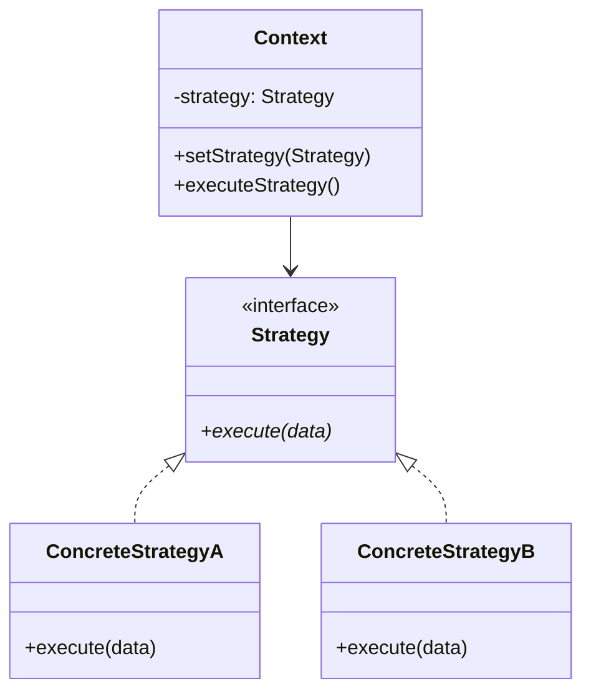
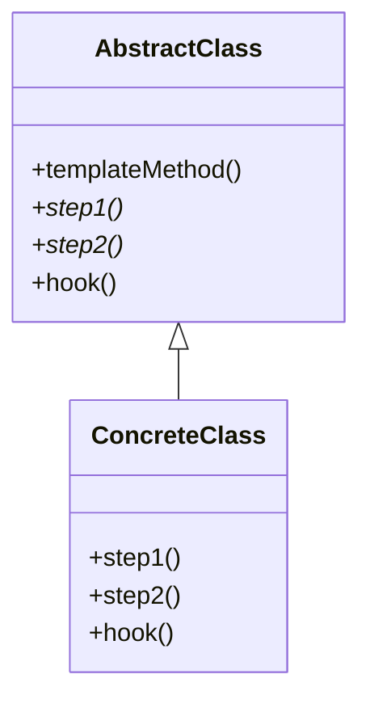
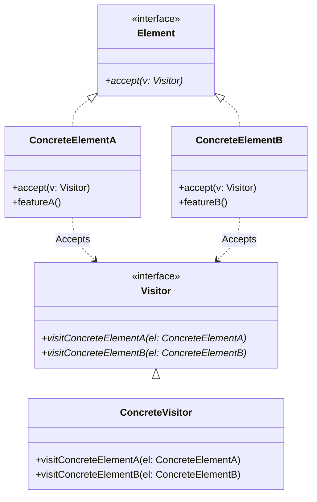

# Các Mẫu Thiết Kế Hành Vi (Behavioral Design Patterns)

Nhóm mẫu hành vi (Behavioral Patterns) liên quan đến việc phân chia trách nhiệm và thuật toán giữa các đối tượng. Chúng không chỉ mô tả cách các đối tượng được cấu trúc, mà còn cả cách chúng giao tiếp với nhau.

---

## 1. Chain of Responsibility

### Khái niệm
**Chain of Responsibility** là mẫu thiết kế cho phép bạn truyền các yêu cầu dọc theo một chuỗi các handler (bộ xử lý). Khi nhận được yêu cầu, mỗi handler sẽ quyết định xử lý yêu cầu đó hoặc chuyển tiếp nó cho handler tiếp theo trong chuỗi.



### Khi nào áp dụng?
*   Khi chương trình cần xử lý nhiều loại yêu cầu khác nhau theo các cách khác nhau, nhưng không biết trước loại yêu cầu và trình tự xử lý (ví dụ: chuỗi kiểm tra bảo mật, phân quyền, xác thực dữ liệu khi nhận request từ client).
*   Khi bạn muốn thực thi một số bộ xử lý theo một thứ tự cụ thể.

### Ưu & Nhược điểm
*   **Ưu điểm**:
    *   Kiểm soát thứ tự xử lý yêu cầu dễ dàng.
    *   *Single Responsibility Principle*: Tách biệt lớp gọi yêu cầu và các lớp xử lý yêu cầu.
    *   *Open/Closed Principle*: Dễ dàng thêm hoặc bớt các handler mới vào chuỗi mà không làm hỏng code cũ.
*   **Nhược điểm**:
    *   Một số yêu cầu có thể bị rơi vào trạng thái không được xử lý nếu nó đi hết chuỗi mà không gặp handler nào phù hợp.

### Ví dụ Code TypeScript
Xây dựng chuỗi Middleware xác thực (Authentication) và phân quyền (Authorization) trước khi xử lý đơn hàng.

```typescript
// Đối tượng dữ liệu request
interface RequestData {
    isLoggedIn: boolean;
    role: string;
    amount: number;
}

// Giao diện Handler
interface Handler {
    setNext(handler: Handler): Handler;
    handle(request: RequestData): boolean;
}

// Handler cơ sở lưu trữ tham chiếu đến handler tiếp theo
abstract class BaseHandler implements Handler {
    private nextHandler: Handler | null = null;

    public setNext(handler: Handler): Handler {
        this.nextHandler = handler;
        return handler; // Cho phép tạo chuỗi liên kết (chaining): h1.setNext(h2).setNext(h3)
    }

    public handle(request: RequestData): boolean {
        if (this.nextHandler) {
            return this.nextHandler.handle(request);
        }
        return true; // Kết thúc chuỗi thành công
    }
}

// Handler 1: Xác thực tài khoản đăng nhập (Authentication)
class AuthenticateHandler extends BaseHandler {
    public handle(request: RequestData): boolean {
        if (!request.isLoggedIn) {
            console.log("❌ Thất bại: Người dùng chưa đăng nhập!");
            return false;
        }
        console.log("✔ Thành công: Đã xác thực người dùng.");
        return super.handle(request);
    }
}

// Handler 2: Kiểm tra quyền truy cập (Authorization)
class AuthorizeHandler extends BaseHandler {
    public handle(request: RequestData): boolean {
        if (request.role !== "admin" && request.role !== "manager") {
            console.log("❌ Thất bại: Quyền truy cập bị từ chối!");
            return false;
        }
        console.log("✔ Thành công: Quyền truy cập hợp lệ.");
        return super.handle(request);
    }
}

// Handler 3: Kiểm tra tính hợp lệ của dữ liệu (Validation)
class ValidationHandler extends BaseHandler {
    public handle(request: RequestData): boolean {
        if (!request.amount || request.amount <= 0) {
            console.log("❌ Thất bại: Số tiền giao dịch không hợp lệ!");
            return false;
        }
        console.log("✔ Thành công: Dữ liệu giao dịch hợp lệ.");
        return super.handle(request);
    }
}

// --- KHÁCH HÀNG SỬ DỤNG ---
// Thiết lập chuỗi xử lý
const authHandler = new AuthenticateHandler();
const roleHandler = new AuthorizeHandler();
const valHandler = new ValidationHandler();

authHandler.setNext(roleHandler).setNext(valHandler);

// Request 1: Hợp lệ
console.log("--- Yêu cầu 1 ---");
const request1: RequestData = { isLoggedIn: true, role: "admin", amount: 150 };
if (authHandler.handle(request1)) {
    console.log("==> Giao dịch được thực hiện thành công!");
}

// Request 2: Sai quyền truy cập
console.log("\n--- Yêu cầu 2 ---");
const request2: RequestData = { isLoggedIn: true, role: "user", amount: 150 };
if (!authHandler.handle(request2)) {
    console.log("==> Giao dịch bị từ chối.");
}
```

---

## 2. Command

### Khái niệm
**Command** (còn gọi là **Action** hoặc **Transaction**) là mẫu thiết kế hành vi giúp chuyển đổi một yêu cầu hoặc tác vụ thành một đối tượng độc lập chứa tất cả thông tin về yêu cầu đó. Việc chuyển đổi này cho phép bạn tham số hóa các phương thức, trì hoãn hoặc xếp hàng đợi thực thi, và hỗ trợ tính năng Hoàn tác (Undo/Redo).



### Khi nào áp dụng?
*   Khi bạn muốn tham số hóa các đối tượng với các hành động cần thực hiện (ví dụ: gắn các lệnh khác nhau vào các nút bấm trên giao diện đồ họa).
*   Khi bạn muốn xếp hàng đợi các hành động, lên lịch thực thi, hoặc thực thi chúng từ xa.
*   Khi bạn cần hỗ trợ các thao tác hoàn tác (Undo/Redo).

### Ưu & Nhược điểm
*   **Ưu điểm**:
    *   *Single Responsibility Principle*: Tách lớp kích hoạt hành động (Invoker) khỏi lớp thực thi nghiệp vụ (Receiver).
    *   *Open/Closed Principle*: Bạn có thể tạo thêm các Command mới mà không cần chỉnh sửa mã nguồn hiện tại.
    *   Dễ dàng thực hiện tính năng hoàn tác (Undo/Redo).
*   **Nhược điểm**:
    *   Số lượng class tăng lên đáng kể do mỗi hành động riêng biệt đều cần một class Command tương ứng.

### Ví dụ Code TypeScript
Xây dựng một bộ tính toán đơn giản có tính năng lưu lịch sử và hoàn tác (Undo).

```typescript
// Lớp thực thi nghiệp vụ chính (Receiver)
class Calculator {
    public value: number = 0;

    public add(amount: number): void { this.value += amount; }
    public subtract(amount: number): void { this.value -= amount; }
}

// Giao diện Command
interface Command {
    execute(): void;
    undo(): void;
}

// Các Command cụ thể
class AddCommand implements Command {
    private calculator: Calculator;
    private amount: number;

    constructor(calculator: Calculator, amount: number) {
        this.calculator = calculator;
        this.amount = amount;
    }

    public execute(): void {
        this.calculator.add(this.amount);
    }

    public undo(): void {
        this.calculator.subtract(this.amount);
    }
}

class SubtractCommand implements Command {
    private calculator: Calculator;
    private amount: number;

    constructor(calculator: Calculator, amount: number) {
        this.calculator = calculator;
        this.amount = amount;
    }

    public execute(): void {
        this.calculator.subtract(this.amount);
    }

    public undo(): void {
        this.calculator.add(this.amount);
    }
}

// Lớp Invoker điều khiển cuộc gọi và quản lý lịch sử (Caretaker)
class CommandManager {
    private history: Command[] = [];

    public execute(command: Command): void {
        command.execute();
        this.history.push(command);
    }

    public undo(): void {
        if (this.history.length === 0) {
            console.log("Không có gì để hoàn tác!");
            return;
        }
        const command = this.history.pop()!;
        command.undo();
    }
}

// --- KHÁCH HÀNG SỬ DỤNG ---
const calculator = new Calculator();
const manager = new CommandManager();

console.log("Giá trị ban đầu:", calculator.value);

manager.execute(new AddCommand(calculator, 10)); // +10
manager.execute(new AddCommand(calculator, 5));  // +5
manager.execute(new SubtractCommand(calculator, 3)); // -3
console.log("Giá trị sau khi thực hiện 3 lệnh:", calculator.value); // 0 + 10 + 5 - 3 = 12

console.log("\n--- Thực hiện hoàn tác (Undo) ---");
manager.undo(); // Hoàn tác lệnh -3 => trở lại 15
console.log("Giá trị sau khi Undo 1 lần:", calculator.value);

manager.undo(); // Hoàn tác lệnh +5 => trở lại 10
console.log("Giá trị sau khi Undo 2 lần:", calculator.value);
```

---

## 3. Iterator

### Khái niệm
**Iterator** là mẫu thiết kế cho phép bạn duyệt qua các phần tử của một tập hợp (collection) một cách tuần tự mà không cần để lộ cấu trúc bên dưới của nó (dạng mảng, danh sách liên kết, cây...).



### Khi nào áp dụng?
*   Khi tập hợp của bạn có cấu trúc dữ liệu phức tạp bên dưới (như dạng cây) và bạn muốn che giấu sự phức tạp đó với client.
*   Khi bạn muốn giảm mã nguồn trùng lặp khi duyệt qua các cấu trúc dữ liệu khác nhau.

### Ưu & Nhược điểm
*   **Ưu điểm**:
    *   *Single Responsibility Principle*: Tách biệt thuật toán duyệt dữ liệu phức tạp ra khỏi lớp chứa dữ liệu.
    *   Dễ dàng duyệt song song hoặc tạm dừng việc duyệt.
*   **Nhược điểm**:
    *   Áp dụng mẫu này cho các cấu trúc dữ liệu đơn giản như mảng thuần túy có thể gây lãng phí tài nguyên và làm phức tạp hóa mã nguồn.

### Ví dụ Code TypeScript
Sử dụng giao thức Iterator chuẩn của ES6 (`[Symbol.iterator]`) để duyệt qua một danh sách bài hát (Playlist) theo cách tùy biến.

```typescript
class Playlist implements Iterable<string> {
    private songs: string[] = [];

    public addSong(song: string): void {
        this.songs.push(song);
    }

    // Hiện thực hóa giao thức Iterator của ES6
    public [Symbol.iterator](): Iterator<string> {
        let index = 0;
        const songs = this.songs;

        return {
            next(): IteratorResult<string> {
                if (index < songs.length) {
                    return { value: songs[index++], done: false };
                } else {
                    return { value: null as any, done: true };
                }
            }
        };
    }
}

// --- KHÁCH HÀNG SỬ DỤNG ---
const myPlaylist = new Playlist();
myPlaylist.addSong("Yesterday - The Beatles");
myPlaylist.addSong("Bohemian Rhapsody - Queen");
myPlaylist.addSong("Hotel California - Eagles");

// Duyệt qua Playlist bằng vòng lặp for...of nhờ vào Iterator
console.log("Duyệt qua danh sách bài hát:");
for (const song of myPlaylist) {
    console.log(`🎶 Đang phát bài: ${song}`);
}
```

---

## 4. Mediator

### Khái niệm
**Mediator** là mẫu thiết kế hành vi giúp giảm bớt các mối quan hệ chằng chéo phức tạp giữa các lớp. Mẫu này hạn chế việc các đối tượng giao tiếp trực tiếp với nhau, thay vào đó ép buộc chúng giao tiếp gián tiếp thông qua một đối tượng trung gian (Mediator).



### Khi nào áp dụng?
*   Khi các lớp trong hệ thống của bạn giao tiếp chéo với nhau quá nhiều, tạo ra một mạng lưới phụ thuộc chằng chit, khó bảo trì.
*   Khi bạn không thể tái sử dụng một lớp ở các ngữ cảnh khác vì nó liên kết quá chặt chẽ với các lớp khác.

### Ưu & Nhược điểm
*   **Ưu điểm**:
    *   *Single Responsibility Principle*: Tập trung các luồng giao tiếp giữa nhiều đối tượng về một nơi duy nhất.
    *   *Open/Closed Principle*: Bạn có thể thêm các Mediator mới mà không ảnh hưởng đến các đối tượng thành phần.
    *   Giảm sự liên kết chặt chẽ (loose coupling) giữa các thành phần giao tiếp.
*   **Nhược điểm**:
    *   Mediator có nguy cơ phình to và biến thành một "God Object" chứa toàn bộ logic tương tác của cả hệ thống.

### Ví dụ Code TypeScript
Mô phỏng hệ thống phòng chat (Chat Room) nơi các người dùng (Users) gửi tin nhắn qua máy chủ trung gian (ChatMediator) thay vì gửi trực tiếp cho nhau.

```typescript
// Giao diện Mediator
interface Mediator {
    send(from: string, to: string, message: string): void;
}

// Đối tượng tham gia tương tác (Colleague)
class User {
    public name: string;
    private mediator: Mediator | null = null;

    constructor(name: string) {
        this.name = name;
    }

    public setMediator(mediator: Mediator): void {
        this.mediator = mediator;
    }

    public send(to: string, message: string): void {
        if (this.mediator) {
            console.log(`[${this.name}] Gửi tin tới [${to}]: "${message}"`);
            this.mediator.send(this.name, to, message);
        }
    }

    public receive(from: string, message: string): void {
        console.log(`[${this.name}] Nhận tin từ [${from}]: "${message}"`);
    }
}

// Lớp Trung Gian (Mediator) cụ thể
class ChatRoomMediator implements Mediator {
    private users: { [key: string]: User } = {};

    public register(user: User): void {
        this.users[user.name] = user;
        user.setMediator(this);
    }

    public send(from: string, to: string, message: string): void {
        const user = this.users[to];
        if (user) {
            user.receive(from, message);
        } else {
            console.log(`Không tìm thấy người dùng ${to}`);
        }
    }
}

// --- KHÁCH HÀNG SỬ DỤNG ---
const chatroom = new ChatRoomMediator();

const alice = new User("Alice");
const bob = new User("Bob");
const charlie = new User("Charlie");

chatroom.register(alice);
chatroom.register(bob);
chatroom.register(charlie);

alice.send("Bob", "Chào Bob, khỏe không?");
bob.send("Alice", "Tớ khỏe, cảm ơn Alice!");
charlie.send("Alice", "Chào hai bạn!");
```

---

## 5. Memento

### Khái niệm
**Memento** là mẫu thiết kế hành vi cho phép bạn chụp lại (capture) và lưu trữ trạng thái nội bộ của một đối tượng tại một thời điểm mà không vi phạm nguyên tắc đóng gói (encapsulation) của đối tượng đó. Trạng thái này có thể được dùng để khôi phục đối tượng về trạng thái cũ sau này.



### Khi nào áp dụng?
*   Khi bạn muốn tạo tính năng hoàn tác (Undo/Redo) hoặc quay lại trạng thái trước đó của đối tượng.
*   Khi việc truy cập trực tiếp các trường dữ liệu của đối tượng phá vỡ tính đóng gói của nó.

### Ưu & Nhược điểm
*   **Ưu điểm**:
    *   Lưu trạng thái của đối tượng mà không phá vỡ tính đóng gói.
    *   Đơn giản hóa lớp chứa dữ liệu (Originator) bằng cách chuyển giao trách nhiệm lưu trữ lịch sử sang lớp Caretaker.
*   **Nhược điểm**:
    *   Có thể tốn rất nhiều bộ nhớ RAM nếu ứng dụng tạo memento quá thường xuyên và dung lượng trạng thái của đối tượng lớn.

### Ví dụ Code TypeScript
Xây dựng tính năng lưu và phục hồi văn bản của một trình soạn thảo (Text Editor).

```typescript
// 1. Memento: Đối tượng chứa dữ liệu trạng thái (bất biến)
class EditorMemento {
    private content: string;

    constructor(content: string) {
        this.content = content;
    }

    public getContent(): string {
        return this.content;
    }
}

// 2. Originator: Đối tượng cần lưu giữ trạng thái
class TextEditor {
    private content: string = "";

    public type(text: string): void {
        this.content += text;
    }

    public getContent(): string {
        return this.content;
    }

    // Tạo bản sao lưu trạng thái
    public save(): EditorMemento {
        return new EditorMemento(this.content);
    }

    // Khôi phục trạng thái từ bản sao lưu
    public restore(memento: EditorMemento): void {
        this.content = memento.getContent();
    }
}

// 3. Caretaker: Quản lý lịch sử các bản sao lưu
class EditorHistory {
    private editor: TextEditor;
    private mementos: EditorMemento[] = [];

    constructor(editor: TextEditor) {
        this.editor = editor;
    }

    public backup(): void {
        console.log("💾 Đang sao lưu trạng thái...");
        this.mementos.push(this.editor.save());
    }

    public undo(): void {
        if (this.mementos.length === 0) {
            console.log("Không có lịch sử sao lưu!");
            return;
        }
        const memento = this.mementos.pop()!;
        console.log("⏪ Đang khôi phục về trạng thái trước...");
        this.editor.restore(memento);
    }
}

// --- KHÁCH HÀNG SỬ DỤNG ---
const editor = new TextEditor();
const history = new EditorHistory(editor);

editor.type("Dòng 1. ");
history.backup(); // Lưu lần 1

editor.type("Dòng 2. ");
history.backup(); // Lưu lần 2

editor.type("Dòng 3. ");
console.log("Văn bản hiện tại:", editor.getContent());

history.undo(); // Undo lần 1
console.log("Sau khi Undo lần 1:", editor.getContent());

history.undo(); // Undo lần 2
console.log("Sau khi Undo lần 2:", editor.getContent());
```

---

## 6. Observer

### Khái niệm
**Observer** (còn gọi là **Publish-Subscribe**) là mẫu thiết kế hành vi định nghĩa một cơ chế đăng ký và theo dõi, giúp thông báo tự động đến nhiều đối tượng (Observers) về bất kỳ sự kiện nào xảy ra với đối tượng đang được theo dõi (Subject).



### Khi nào áp dụng?
*   Khi sự thay đổi trạng thái của một đối tượng yêu cầu thay đổi các đối tượng khác, và bạn không biết trước có bao nhiêu đối tượng cần thay đổi.
*   Khi một số đối tượng cần quan sát đối tượng khác nhưng chỉ trong một số trường hợp nhất định hoặc trong thời gian ngắn.

### Ưu & Nhược điểm
*   **Ưu điểm**:
    *   *Open/Closed Principle*: Bạn có thể thêm các Observer mới mà không cần chỉnh sửa code của Subject (và ngược lại).
    *   Thiết lập mối quan hệ lỏng lẻo ở thời gian chạy (runtime coupling).
*   **Nhược điểm**:
    *   Các Observer được thông báo theo thứ tự ngẫu nhiên.
    *   Có thể gây rò rỉ bộ nhớ (Memory Leak) nếu quên huỷ đăng ký (unsubscribe) các observer không còn sử dụng.

### Ví dụ Code TypeScript
Mô phỏng cửa hàng trực tuyến (Store) thông báo cho khách hàng (Customers) đăng ký nhận tin khi sản phẩm có hàng trở lại (Restock).

```typescript
// 1. Observer Interface (Người quan sát)
interface Observer {
    update(productName: string): void;
}

// 2. Concrete Observer (Người đăng ký cụ thể)
class Customer implements Observer {
    public name: string;

    constructor(name: string) {
        this.name = name;
    }

    public update(productName: string): void {
        console.log(`🔔 [Thông báo gửi tới ${this.name}]: Sản phẩm "${productName}" đã có hàng! Hãy mua ngay.`);
    }
}

// 3. Subject (Nhà xuất bản)
class OnlineStore {
    private subscribers: Observer[] = [];
    private productsInStock: string[] = [];

    public subscribe(customer: Observer): void {
        this.subscribers.push(customer);
        // Ở đây ép kiểu để truy cập name của Customer cho mục đích demo log
        console.log(`[Cửa hàng] Một khách hàng đã đăng ký nhận thông báo.`);
    }

    public unsubscribe(customer: Observer): void {
        this.subscribers = this.subscribers.filter(sub => sub !== customer);
        console.log(`[Cửa hàng] Một khách hàng đã huỷ đăng ký.`);
    }

    public restockProduct(productName: string): void {
        console.log(`\n[Cửa hàng] Nhập hàng mới: "${productName}"!`);
        this.productsInStock.push(productName);
        this.notifySubscribers(productName);
    }

    private notifySubscribers(productName: string): void {
        this.subscribers.forEach(sub => sub.update(productName));
    }
}

// --- KHÁCH HÀNG SỬ DỤNG ---
const store = new OnlineStore();

const customer1 = new Customer("Nguyễn Văn A");
const customer2 = new Customer("Trần Thị B");

store.subscribe(customer1);
store.subscribe(customer2);

// Nhập hàng
store.restockProduct("iPhone 15 Pro Max");

// Khách hàng B huỷ đăng ký
store.unsubscribe(customer2);

// Nhập hàng tiếp theo
store.restockProduct("MacBook Pro M3");
```

---

## 7. State

### Khái niệm
**State** là mẫu thiết kế hành vi cho phép một đối tượng thay đổi hành vi của nó khi trạng thái nội bộ thay đổi. Đối tượng sẽ trông như thể đã thay đổi lớp của nó (class).



### Khi nào áp dụng?
*   Khi bạn có một đối tượng hoạt động khác nhau tùy thuộc vào trạng thái hiện tại của nó, số lượng trạng thái lớn và mã nguồn ngập tràn các câu điều kiện `if-else` hoặc `switch-case` phức tạp.
*   Khi bạn muốn tách biệt logic của các trạng thái cụ thể ra khỏi lớp chính.

### Ưu & Nhược điểm
*   **Ưu điểm**:
    *   *Single Responsibility Principle*: Gom các mã nguồn liên quan đến một trạng thái cụ thể vào một lớp riêng.
    *   *Open/Closed Principle*: Dễ dàng thêm trạng thái mới mà không ảnh hưởng đến logic của các trạng thái hiện tại hoặc lớp ngữ cảnh (Context).
    *   Loại bỏ các cấu trúc rẽ nhánh điều kiện cồng kềnh.
*   **Nhược điểm**:
    *   Áp dụng mẫu này cho các máy trạng thái đơn giản (chỉ có 2-3 trạng thái và ít thay đổi) sẽ làm quá tải mã nguồn một cách không cần thiết.

### Ví dụ Code TypeScript
Quản lý trạng thái phát nhạc của một ứng dụng Audio Player (Chờ phát -> Đang phát -> Tạm dừng).

```typescript
class AudioPlayer {
    private state: State;

    constructor() {
        this.state = new ReadyState(); // Trạng thái mặc định ban đầu
    }

    public changeState(state: State): void {
        this.state = state;
    }

    // Hành động kích hoạt nút bấm Play/Pause
    public clickPlay(): void {
        this.state.clickPlay(this);
    }
}

// Lớp Trạng Thái cơ sở
abstract class State {
    public abstract clickPlay(player: AudioPlayer): void;
}

// Trạng thái cụ thể 1: Đang phát (PlayingState)
class PlayingState extends State {
    public clickPlay(player: AudioPlayer): void {
        player.changeState(new PausedState());
        console.log("⏸ Tạm dừng phát nhạc.");
    }
}

// Trạng thái cụ thể 2: Tạm dừng (PausedState)
class PausedState extends State {
    public clickPlay(player: AudioPlayer): void {
        player.changeState(new PlayingState());
        console.log("▶ Tiếp tục phát nhạc.");
    }
}

// Trạng thái cụ thể 3: Đang dừng hẳn (ReadyState)
class ReadyState extends State {
    public clickPlay(player: AudioPlayer): void {
        player.changeState(new PlayingState());
        console.log("🎵 Bắt đầu phát bài hát đầu tiên.");
    }
}

// --- KHÁCH HÀNG SỬ DỤNG ---
const myPlayer = new AudioPlayer();

// Nhấp nút Play lần 1 (khi đang ở ReadyState)
myPlayer.clickPlay();

// Nhấp nút Play lần 2 (khi đang phát nhạc - PlayingState)
myPlayer.clickPlay();

// Nhấp nút Play lần 3 (khi đang tạm dừng - PausedState)
myPlayer.clickPlay();
```

---

## 8. Strategy

### Khái niệm
**Strategy** là mẫu thiết kế hành vi cho phép bạn định nghĩa một tập hợp các thuật toán giải quyết cùng một vấn đề, đóng gói từng thuật toán đó trong các lớp riêng biệt, và làm cho chúng có thể hoán đổi cho nhau linh hoạt ở thời gian chạy (runtime).



### Khi nào áp dụng?
*   Khi bạn muốn sử dụng các biến thể khác nhau của một thuật toán bên trong một đối tượng và có thể chuyển đổi thuật toán này sang thuật toán khác ngay khi chương trình đang chạy.
*   Khi bạn có nhiều lớp tương tự nhau chỉ khác biệt ở cách chúng thực thi một số hành vi nhất định.
*   Khi bạn muốn cô lập logic nghiệp vụ của một lớp khỏi các chi tiết thực thi của thuật toán.

### Ưu & Nhược điểm
*   **Ưu điểm**:
    *   Có thể thay đổi thuật toán được sử dụng bên trong một đối tượng khi đang chạy.
    *   Tách biệt chi tiết thực thi của thuật toán ra khỏi mã nguồn sử dụng thuật toán.
    *   Thay thế kế thừa bằng thành phần (Composition).
    *   *Open/Closed Principle*: Bạn có thể thêm thuật toán mới mà không cần chạm vào mã nguồn client hoặc các thuật toán cũ.
*   **Nhược điểm**:
    *   Client phải nhận biết và hiểu sự khác biệt giữa các Strategy để chọn ra chiến lược phù hợp nhất.
    *   Các ngôn ngữ lập trình hiện đại hỗ trợ functional programming (như JS/TS) có thể thay thế mẫu này bằng cách truyền trực tiếp hàm (callbacks).

### Ví dụ Code TypeScript
Hệ thống thanh toán mua hàng trực tuyến hỗ trợ nhiều phương thức khác nhau: Ví điện tử MoMo, Thẻ tín dụng Credit Card, và PayPal.

```typescript
// Giao diện Chiến lược thanh toán
interface PaymentStrategy {
    pay(amount: number): string;
}

// Các Chiến Lược cụ thể (Concrete Strategies)
class PayPalStrategy implements PaymentStrategy {
    private email: string;
    constructor(email: string) {
        this.email = email;
    }
    public pay(amount: number): string {
        return `Thanh toán ${amount} VND thành công qua cổng PayPal (Tài khoản: ${this.email})`;
    }
}

class CreditCardStrategy implements PaymentStrategy {
    private cardNumber: string;
    private cvv: string;
    constructor(cardNumber: string, cvv: string) {
        this.cardNumber = cardNumber;
        this.cvv = cvv;
    }
    public pay(amount: number): string {
        return `Thanh toán ${amount} VND thành công bằng Thẻ Tín Dụng (Số thẻ: ${this.cardNumber.substring(0,4)}... )`;
    }
}

class MoMoStrategy implements PaymentStrategy {
    private phoneNumber: string;
    constructor(phoneNumber: string) {
        this.phoneNumber = phoneNumber;
    }
    public pay(amount: number): string {
        return `Thanh toán ${amount} VND thành công qua Ví MoMo (SĐT: ${this.phoneNumber})`;
    }
}

// Đối tượng sử dụng chiến lược (Context)
class OrderCheckout {
    private amount: number;
    private paymentStrategy: PaymentStrategy | null = null;

    constructor(amount: number) {
        this.amount = amount;
    }

    public setPaymentStrategy(strategy: PaymentStrategy): void {
        this.paymentStrategy = strategy;
    }

    public executePayment(): string {
        if (!this.paymentStrategy) {
            throw new Error("Vui lòng chọn phương thức thanh toán trước khi Checkout!");
        }
        return this.paymentStrategy.pay(this.amount);
    }
}

// --- KHÁCH HÀNG SỬ DỤNG ---
const cart = new OrderCheckout(250000); // Đơn hàng trị giá 250,000 VND

// Khách chọn thanh toán bằng MoMo
cart.setPaymentStrategy(new MoMoStrategy("0987654321"));
console.log(cart.executePayment());

// Khách đổi ý, chuyển sang dùng Thẻ Tín Dụng
cart.setPaymentStrategy(new CreditCardStrategy("1234-5678-9012-3456", "123"));
console.log(cart.executePayment());
```

---

## 9. Template Method

### Khái niệm
**Template Method** là mẫu thiết kế hành vi định nghĩa khung xương (bộ khung) của một thuật toán trong lớp cha, nhưng cho phép các lớp con ghi đè các bước cụ thể của thuật toán đó mà không làm thay đổi cấu trúc tổng thể của thuật toán.



### Khi nào áp dụng?
*   Khi bạn muốn cho phép khách hàng mở rộng hoặc thay thế một số bước cụ thể của thuật toán, nhưng không cho phép thay đổi cấu trúc tổng thể của thuật toán đó.
*   Khi bạn có nhiều lớp thực hiện các công việc gần như giống hệt nhau, chỉ khác biệt một vài chi tiết nhỏ (giúp hạn chế trùng lặp mã nguồn).

### Ưu & Nhược điểm
*   **Ưu điểm**:
    *   Tái sử dụng mã nguồn hiệu quả bằng cách đưa phần code chung lên lớp cha và chỉ để lớp con hiện thực hóa phần code khác biệt.
*   **Nhược điểm**:
    *   Lớp con có thể bị giới hạn bởi bộ khung xương của thuật toán được xác định ở lớp cha.
    *   Vi phạm nguyên tắc thay thế Liskov (Liskov Substitution Principle) nếu lớp con cố tình ghi đè các bước mặc định theo cách làm thay đổi ý nghĩa thuật toán.

### Ví dụ Code TypeScript
Hệ thống khai thác dữ liệu (Data Miner). Các bước luôn là: Mở tệp -> Đọc dữ liệu thô -> Phân tích dữ liệu -> Đóng tệp. Điểm khác biệt là bước Đọc dữ liệu thô từ định dạng CSV khác với tệp JSON.

```typescript
// Lớp cha trừu tượng định nghĩa Template Method
abstract class DataMiner {
    // Thuật toán cốt lõi (Template Method)
    public mine(path: string): void {
        this.openFile(path);
        const rawData = this.readRawData();
        const results = this.parseData(rawData);
        this.generateReport(results);
        this.closeFile();
    }

    // Các bước chung
    protected openFile(path: string): void {
        console.log(`📂 Đã mở tệp tại đường dẫn: ${path}`);
    }

    protected closeFile(): void {
        console.log("🔒 Đã đóng tệp thành công.");
    }

    protected generateReport(results: any[]): void {
        console.log(`📊 Kết quả báo cáo: tìm thấy ${results.length} bản ghi hợp lệ.`);
    }

    // Các bước buộc các lớp con phải tự thực thi (Abstract Methods)
    protected abstract readRawData(): string;
    protected abstract parseData(rawData: string): any[];
}

// Lớp con cụ thể 1: Đọc tệp CSV
class CSVDataMiner extends DataMiner {
    protected readRawData(): string {
        console.log("Đang đọc dữ liệu thô từ tệp CSV...");
        return "name,age\nAlice,30\nBob,25";
    }

    protected parseData(rawData: string): any[] {
        console.log("Đang chuyển đổi cấu trúc CSV sang danh sách đối tượng...");
        return rawData.split("\n").slice(1).map(line => {
            const [name, age] = line.split(",");
            return { name, age: parseInt(age, 10) };
        });
    }
}

// Lớp con cụ thể 2: Đọc tệp JSON
class JSONDataMiner extends DataMiner {
    protected readRawData(): string {
        console.log("Đang đọc dữ liệu thô dạng chuỗi JSON...");
        return '[{"name": "Charlie", "age": 35}]';
    }

    protected parseData(rawData: string): any[] {
        console.log("Đang phân tích cú pháp JSON (JSON.parse)...");
        return JSON.parse(rawData);
    }
}

// --- KHÁCH HÀNG SỬ DỤNG ---
console.log("--- Khai thác tệp CSV ---");
const csvMiner = new CSVDataMiner();
csvMiner.mine("data.csv");

console.log("\n--- Khai thác tệp JSON ---");
const jsonMiner = new JSONDataMiner();
jsonMiner.mine("data.json");
```

---

## 10. Visitor

### Khái niệm
**Visitor** là mẫu thiết kế hành vi cho phép bạn tách biệt các thuật toán và tác vụ xử lý ra khỏi cấu trúc đối tượng mà chúng đang hoạt động trên đó. Bằng cách sử dụng cơ chế double dispatch, bạn có thể thêm các hành vi mới vào cấu trúc lớp đối tượng có sẵn mà không cần thay đổi mã nguồn của các lớp này.



### Khi nào áp dụng?
*   Khi bạn cần thực hiện một thao tác trên tất cả các phần tử của một cấu trúc đối tượng phức tạp (chẳng hạn như một cây đối tượng), và bạn không muốn thay đổi các lớp của các phần tử đó để thêm thao tác này.
*   Khi các lớp trong cấu trúc đối tượng của bạn hiếm khi thay đổi, nhưng bạn thường xuyên cần bổ sung các thao tác xử lý mới trên chúng.

### Ưu & Nhược điểm
*   **Ưu điểm**:
    *   *Open/Closed Principle*: Bạn có thể tạo ra hành vi mới hoạt động trên các lớp khác nhau mà không cần chạm vào mã nguồn của các lớp này.
    *   *Single Responsibility Principle*: Tập trung các hành động/thuật toán liên quan về một lớp duy nhất (Visitor class).
*   **Nhược điểm**:
    *   Mỗi khi có một phần tử mới được thêm vào cấu trúc cây đối tượng, bạn phải cập nhật tất cả các lớp Visitor hiện có.
    *   Visitor có thể gặp khó khăn khi truy cập các trường dữ liệu private của các đối tượng mà nó ghé thăm.

### Ví dụ Code TypeScript
Xuất thông tin của các hình học (Circle, Rectangle) sang định dạng XML thông qua một ExportVisitor mà không cần thêm code xuất file vào các lớp hình học.

```typescript
// Giao diện Phần tử hình học (Element Interface)
interface Shape {
    accept(visitor: Visitor): string;
}

// Các phần tử cụ thể
class Circle implements Shape {
    public radius: number;

    constructor(radius: number) {
        this.radius = radius;
    }

    public accept(visitor: Visitor): string {
        // Double dispatch: Đối tượng truyền chính nó vào Visitor
        return visitor.visitCircle(this);
    }
}

class Rectangle implements Shape {
    public width: number;
    public height: number;

    constructor(width: number, height: number) {
        this.width = width;
        this.height = height;
    }

    public accept(visitor: Visitor): string {
        return visitor.visitRectangle(this);
    }
}

// Giao diện Khách ghé thăm (Visitor Interface)
interface Visitor {
    visitCircle(circle: Circle): string;
    visitRectangle(rectangle: Rectangle): string;
}

// Đối tượng Visitor cụ thể: Trích xuất thông tin ra định dạng XML
class XMLExportVisitor implements Visitor {
    public visitCircle(circle: Circle): string {
        return `<circle>\n  <radius>${circle.radius}</radius>\n</circle>`;
    }

    public visitRectangle(rectangle: Rectangle): string {
        return `<rectangle>\n  <width>${rectangle.width}</width>\n  <height>${rectangle.height}</height>\n</rectangle>`;
    }
}

// --- KHÁCH HÀNG SỬ DỤNG ---
const shapes: Shape[] = [
    new Circle(10),
    new Rectangle(20, 30),
    new Circle(5)
];

const xmlVisitor = new XMLExportVisitor();

console.log("Xuất định dạng XML của các hình hình học:");
shapes.forEach(shape => {
    console.log(shape.accept(xmlVisitor));
});
```
