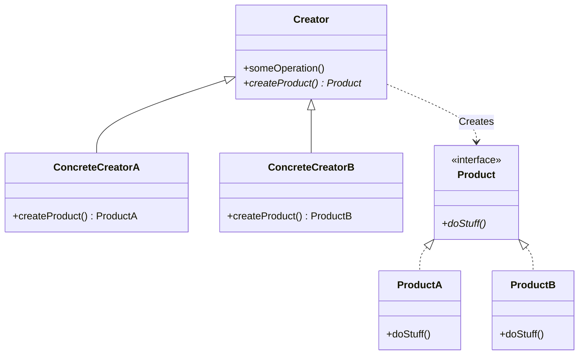
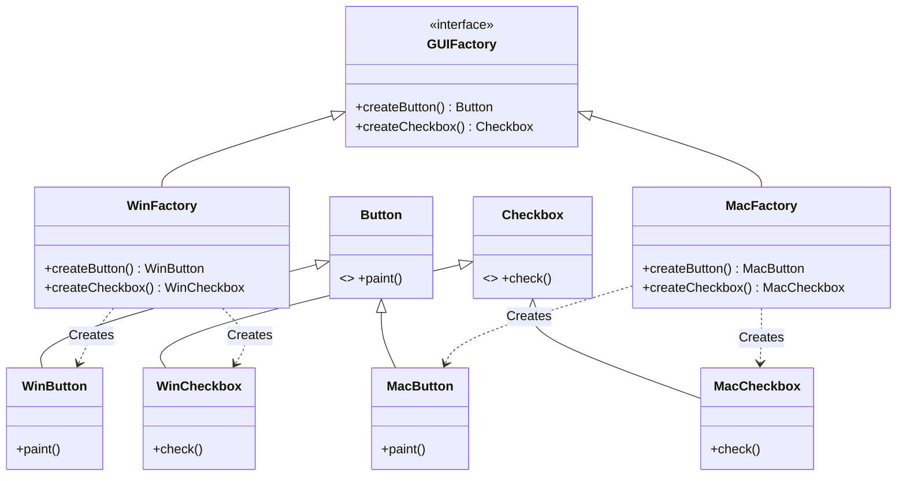
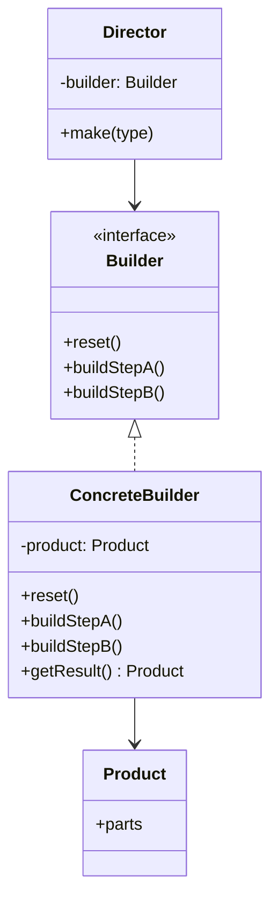
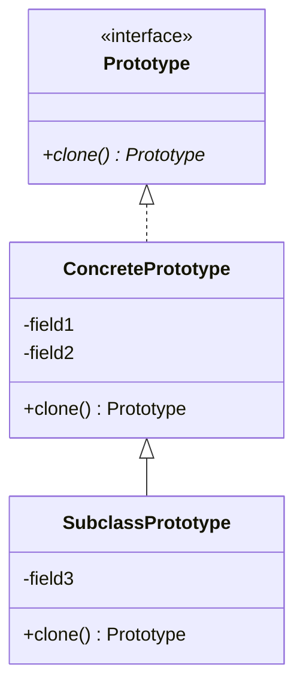
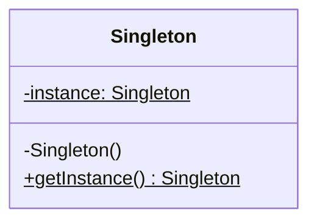

# Các Mẫu Thiết Kế Khởi Tạo (Creational Design Patterns)

Nhóm mẫu khởi tạo (Creational Patterns) cung cấp các cơ chế khởi tạo đối tượng khác nhau, giúp tăng tính linh hoạt và khả năng tái sử dụng mã nguồn.

---

## 1. Factory Method

### Khái niệm
**Factory Method** (còn gọi là **Virtual Constructor**) là mẫu thiết kế định nghĩa một giao diện (interface hoặc class cha) để tạo đối tượng, nhưng cho phép các lớp con quyết định loại đối tượng nào sẽ được khởi tạo.



### Khi nào áp dụng?
*   Khi bạn không biết trước chính xác kiểu và phụ thuộc của các đối tượng mà code của bạn cần làm việc cùng.
*   Khi bạn muốn cung cấp cho người dùng thư viện hoặc framework của bạn khả năng mở rộng các thành phần bên trong nó.
*   Khi bạn muốn tiết kiệm tài nguyên hệ thống bằng cách tái sử dụng các đối tượng hiện có thay vì xây dựng lại chúng mỗi lần (caching/pooling).

### Ưu & Nhược điểm
*   **Ưu điểm**: 
    *   Tránh sự liên kết chặt chẽ (tight coupling) giữa người dùng và các sản phẩm cụ thể.
    *   *Single Responsibility Principle*: Logic tạo sản phẩm nằm tập trung ở một nơi, giúp mã nguồn dễ bảo trì.
    *   *Open/Closed Principle*: Dễ dàng thêm các loại sản phẩm mới vào chương trình mà không làm hỏng code hiện tại.
*   **Nhược điểm**: 
    *   Mã nguồn có thể trở nên phức tạp hơn do phải giới thiệu nhiều lớp con mới.

### Ví dụ Code TypeScript
Giả lập hệ thống Logistic (Vận tải) hỗ trợ vận chuyển bằng Đường bộ (Xe tải) và Đường biển (Tàu thủy).

```typescript
// Interface sản phẩm chung
interface Transport {
    deliver(): string;
}

// Các sản phẩm cụ thể triển khai interface Transport
class Truck implements Transport {
    public deliver(): string {
        return "Vận chuyển bằng Xe Tải qua đường bộ. Đóng gói trong hộp cát-tông.";
    }
}

class Ship implements Transport {
    public deliver(): string {
        return "Vận chuyển bằng Tàu Thủy qua đường biển. Đóng gói trong container.";
    }
}

// Lớp Creator trừu tượng định nghĩa Factory Method
abstract class Logistics {
    // Factory Method trừu tượng buộc lớp con tự triển khai
    public abstract createTransport(): Transport;

    // Một tác vụ chung sử dụng sản phẩm được tạo từ Factory Method
    public planDelivery(): string {
        // Gọi Factory Method để tạo ra đối tượng sản phẩm thích hợp
        const transport = this.createTransport();
        return `Kế hoạch: ${transport.deliver()}`;
    }
}

// Các Creator cụ thể ghi đè Factory Method để trả về sản phẩm tương ứng
class RoadLogistics extends Logistics {
    public createTransport(): Transport {
        return new Truck();
    }
}

class SeaLogistics extends Logistics {
    public createTransport(): Transport {
        return new Ship();
    }
}

// --- KHÁCH HÀNG SỬ DỤNG ---
function runLogistics(logisticsApp: Logistics): void {
    console.log(logisticsApp.planDelivery());
}

console.log("--- Vận chuyển đường bộ ---");
runLogistics(new RoadLogistics());

console.log("\n--- Vận chuyển đường biển ---");
runLogistics(new SeaLogistics());
```

---

## 2. Abstract Factory

### Khái niệm
**Abstract Factory** là mẫu thiết kế cho phép bạn tạo ra một tập hợp (họ) các đối tượng liên quan hoặc phụ thuộc lẫn nhau mà không cần chỉ định các lớp cụ thể của chúng.



### Khi nào áp dụng?
*   Khi code của bạn cần làm việc với nhiều họ sản phẩm liên quan, nhưng bạn không muốn nó phụ thuộc vào các lớp cụ thể của các sản phẩm đó (có thể thay đổi linh hoạt các họ sản phẩm này trong tương lai).

### Ưu & Nhược điểm
*   **Ưu điểm**:
    *   Đảm bảo các sản phẩm bạn nhận được từ một factory tương thích với nhau.
    *   Tránh liên kết chặt chẽ giữa code client và các sản phẩm cụ thể.
    *   *Single Responsibility Principle* và *Open/Closed Principle*.
*   **Nhược điểm**:
    *   Mã nguồn trở nên cồng kềnh vì đòi hỏi định nghĩa rất nhiều interface và class mới.

### Ví dụ Code TypeScript
Tạo các thành phần giao diện (UI Components) cho hai hệ điều hành: Windows và macOS.

```typescript
// --- ABSTRACT PRODUCTS (GIAO DIỆN SẢN PHẨM) ---
interface Button {
    paint(): string;
}

interface Checkbox {
    check(): string;
}

// --- CONCRETE PRODUCTS (HỌ WINDOWS) ---
class WindowsButton implements Button {
    public paint(): string {
        return "Đang vẽ một nút bấm phong cách Windows [=]";
    }
}

class WindowsCheckbox implements Checkbox {
    public check(): string {
        return "Đang vẽ một ô chọn phong cách Windows [x]";
    }
}

// --- CONCRETE PRODUCTS (HỌ MACOS) ---
class MacButton implements Button {
    public paint(): string {
        return "Đang vẽ một nút bấm phong cách macOS (•)";
    }
}

class MacCheckbox implements Checkbox {
    public check(): string {
        return "Đang vẽ một ô chọn phong cách macOS (checkmark)";
    }
}

// --- ABSTRACT FACTORY (NHÀ MÁY TRỪU TƯỢNG) ---
interface GUIFactory {
    createButton(): Button;
    createCheckbox(): Checkbox;
}

// --- CONCRETE FACTORIES (NHÀ MÁY CỤ THỂ) ---
class WindowsFactory implements GUIFactory {
    public createButton(): Button {
        return new WindowsButton();
    }
    public createCheckbox(): Checkbox {
        return new WindowsCheckbox();
    }
}

class MacFactory implements GUIFactory {
    public createButton(): Button {
        return new MacButton();
    }
    public createCheckbox(): Checkbox {
        return new MacCheckbox();
    }
}

// --- KHÁCH HÀNG SỬ DỤNG ---
class Application {
    private factory: GUIFactory;
    private button!: Button;
    private checkbox!: Checkbox;

    constructor(factory: GUIFactory) {
        this.factory = factory;
    }

    public createUI(): void {
        this.button = this.factory.createButton();
        this.checkbox = this.factory.createCheckbox();
    }

    public paint(): void {
        console.log(this.button.paint());
        console.log(this.checkbox.check());
    }
}

// Cấu hình ứng dụng chạy trên Windows
console.log("--- Khởi tạo app trên Windows ---");
const winApp = new Application(new WindowsFactory());
winApp.createUI();
winApp.paint();

// Cấu hình ứng dụng chạy trên macOS
console.log("\n--- Khởi tạo app trên macOS ---");
const macApp = new Application(new MacFactory());
macApp.createUI();
macApp.paint();
```

---

## 3. Builder

### Khái niệm
**Builder** là mẫu thiết kế cho phép bạn xây dựng các đối tượng phức tạp theo từng bước một. Pattern này cho phép bạn tạo ra các kiểu dáng và biểu diễn khác nhau của cùng một đối tượng bằng cách sử dụng cùng một mã xây dựng.



### Khi nào áp dụng?
*   Khi bạn muốn loại bỏ một hàm khởi tạo chứa quá nhiều tham số tùy chọn (anti-pattern tên là "telescoping constructor").
*   Khi bạn muốn sử dụng cùng một mã xây dựng để tạo ra các dạng biểu diễn khác nhau của cùng một sản phẩm (ví dụ: tạo file PDF, JSON, HTML bằng cùng một chuỗi hành động).
*   Khi bạn cần xây dựng các cây cấu trúc phức tạp (như Composite trees).

### Ưu & Nhược điểm
*   **Ưu điểm**:
    *   Cho phép bạn xây dựng đối tượng theo từng bước, hoãn các bước hoặc chạy đệ quy.
    *   Tái sử dụng cùng một code xây dựng cho nhiều biến thể sản phẩm khác nhau.
    *   *Single Responsibility Principle*: Tách biệt mã xây dựng phức tạp ra khỏi logic nghiệp vụ chính của sản phẩm.
*   **Nhược điểm**:
    *   Độ phức tạp tổng thể tăng do cần tạo thêm nhiều class Builder mới.

### Ví dụ Code TypeScript
Xây dựng một bộ dựng câu truy vấn SQL (SQL Query Builder) - ứng dụng rất phổ biến trong các thư viện Node.js/TS (như Knex, Sequelize).

```typescript
interface Query {
    select: string[];
    from: string;
    where: string[];
    limit: number | null;
}

class SQLQueryBuilder {
    private query!: Query;

    constructor() {
        this.reset();
    }

    public reset(): this {
        this.query = {
            select: [],
            from: "",
            where: [],
            limit: null
        };
        return this; // trả về this để thực hiện method chaining
    }

    public select(fields: string | string[]): this {
        this.query.select = Array.isArray(fields) ? fields : [fields];
        return this;
    }

    public from(table: string): this {
        this.query.from = table;
        return this;
    }

    public where(condition: string): this {
        this.query.where.push(condition);
        return this;
    }

    public limit(number: number): this {
        this.query.limit = number;
        return this;
    }

    // Lấy ra câu SQL hoàn chỉnh sau khi build xong
    public getQuery(): string {
        let sql = `SELECT ${this.query.select.length > 0 ? this.query.select.join(', ') : '*'} `;
        
        if (!this.query.from) {
            throw new Error("Thiếu bảng dữ liệu (FROM)!");
        }
        sql += `FROM ${this.query.from}`;

        if (this.query.where.length > 0) {
            sql += ` WHERE ${this.query.where.join(' AND ')}`;
        }

        if (this.query.limit !== null) {
            sql += ` LIMIT ${this.query.limit}`;
        }

        sql += ";";
        const result = sql;
        this.reset(); // reset builder cho các câu query tiếp theo
        return result;
    }
}

// --- KHÁCH HÀNG SỬ DỤNG ---
const builder = new SQLQueryBuilder();

// Truy vấn cơ bản
const basicQuery = builder
    .select(["id", "name"])
    .from("users")
    .getQuery();
console.log("Basic SQL:", basicQuery);

// Truy vấn phức tạp
const advancedQuery = builder
    .select(["id", "title", "created_at"])
    .from("posts")
    .where("status = 'published'")
    .where("author_id = 1")
    .limit(10)
    .getQuery();
console.log("Advanced SQL:", advancedQuery);
```

---

## 4. Prototype

### Khái niệm
**Prototype** là mẫu thiết kế cho phép sao chép các đối tượng hiện có mà không làm cho mã của bạn phụ thuộc vào các lớp cụ thể của chúng. Nó giải quyết bài toán nhân bản một đối tượng (clone) một cách chính xác nhất.



### Khi nào áp dụng?
*   Khi bạn cần sao chép các đối tượng mà code của bạn không nên phụ thuộc vào các lớp cụ thể của chúng (ví dụ: nhận một đối tượng từ thư viện bên ngoài qua một interface).
*   Khi bạn muốn giảm số lượng lớp con vốn chỉ khác nhau ở cách chúng khởi tạo các đối tượng tương ứng.

### Ưu & Nhược điểm
*   **Ưu điểm**:
    *   Bạn có thể clone các đối tượng mà không cần biết lớp cụ thể của chúng.
    *   Bỏ qua việc khởi tạo lặp đi lặp lại phức tạp giúp cải thiện hiệu năng.
    *   Dễ dàng tạo các đối tượng phức tạp bằng cách lấy một đối tượng mẫu có sẵn và sửa đổi nó.
*   **Nhược điểm**:
    *   Nhân bản các đối tượng phức tạp có tham chiếu chéo (circular reference) có thể cực kỳ phức tạp (cần phân biệt Deep Clone và Shallow Clone).

### Ví dụ Code TypeScript
Sao chép các đối tượng hình học (Shapes) trong ứng dụng vẽ đồ họa.

```typescript
abstract class Shape {
    public x: number;
    public y: number;
    public color: string;

    constructor(source?: Shape) {
        if (source) {
            this.x = source.x;
            this.y = source.y;
            this.color = source.color;
        } else {
            this.x = 0;
            this.y = 0;
            this.color = "black";
        }
    }

    public abstract clone(): Shape;
}

class Circle extends Shape {
    public radius: number;

    constructor(source?: Circle) {
        super(source);
        if (source) {
            this.radius = source.radius;
        } else {
            this.radius = 0;
        }
    }

    public clone(): Shape {
        return new Circle(this);
    }
}

// --- KHÁCH HÀNG SỬ DỤNG ---
const firstCircle = new Circle();
firstCircle.x = 10;
firstCircle.y = 20;
firstCircle.color = "red";
firstCircle.radius = 15;

// Nhân bản hình tròn ban đầu
const clonedCircle = firstCircle.clone() as Circle;

console.log("Hình gốc: ", firstCircle);
console.log("Hình nhân bản: ", clonedCircle);
console.log("Hai hình có cùng tham chiếu không?", firstCircle === clonedCircle ? "Có" : "Không (Clone thành công)");
```

---

## 5. Singleton

### Khái niệm
**Singleton** là mẫu thiết kế đảm bảo một lớp chỉ có duy nhất một thực thể (instance) trong suốt vòng đời của ứng dụng và cung cấp một điểm truy cập toàn cục cho thực thể đó.



### Khi nào áp dụng?
*   Khi một lớp trong chương trình của bạn chỉ nên có một instance duy nhất khả dụng cho tất cả client (ví dụ: một cơ sở dữ liệu dùng chung, một logger tập trung, hoặc hệ thống cấu hình toàn cục).
*   Khi bạn muốn kiểm soát chặt chẽ hơn đối với các biến toàn cục.

### Ưu & Nhược điểm
*   **Ưu điểm**:
    *   Đảm bảo chắc chắn rằng một lớp chỉ có duy nhất một thực thể.
    *   Cung cấp điểm truy cập toàn cầu cho thực thể đó.
    *   Thực thể chỉ được khởi tạo khi được gọi đến lần đầu tiên (Lazy Initialization).
*   **Nhược điểm**:
    *   Vi phạm *Single Responsibility Principle* (Lớp vừa giải quyết vấn đề nghiệp vụ của nó, vừa tự quản lý vòng đời của chính mình).
    *   Khó viết Unit Test vì trạng thái của Singleton có thể bị thay đổi giữa các bài test (gây ra side effects).
    *   Cần đặc biệt lưu ý xử lý đa luồng (Multi-threading) trong các ngôn ngữ như Java/C# (dễ gặp tình trạng race condition khi tạo instance). JavaScript/TypeScript chạy đơn luồng (event loop) nên không bị vấn đề này.

### Ví dụ Code TypeScript
Quản lý kết nối cơ sở dữ liệu (Database Connection) dùng chung toàn cục.

```typescript
class DatabaseConnection {
    private static instance: DatabaseConnection | null = null;
    public connectionString: string;
    public id: number;

    // constructor là private ngăn việc gọi trực tiếp qua từ khoá `new` từ bên ngoài
    private constructor() {
        this.connectionString = "mongodb://localhost:27017/my_db";
        this.id = Math.random(); // Dùng ID ngẫu nhiên để chứng minh chỉ có 1 instance duy nhất được tạo ra
        console.log(`Đã mở kết nối Database với ID: ${this.id}`);
    }

    public static getInstance(): DatabaseConnection {
        if (!DatabaseConnection.instance) {
            DatabaseConnection.instance = new DatabaseConnection();
        }
        return DatabaseConnection.instance;
    }

    public query(sql: string): void {
        console.log(`[DB Instance ${this.id}] Thực thi câu lệnh: "${sql}"`);
    }
}

// --- KHÁCH HÀNG SỬ DỤNG ---
const db1 = DatabaseConnection.getInstance();
db1.query("SELECT * FROM users");

const db2 = DatabaseConnection.getInstance();
db2.query("SELECT * FROM products");

console.log("db1 và db2 có cùng trỏ tới một đối tượng không?", db1 === db2 ? "Có (Singleton hoạt động)" : "Không");
```
