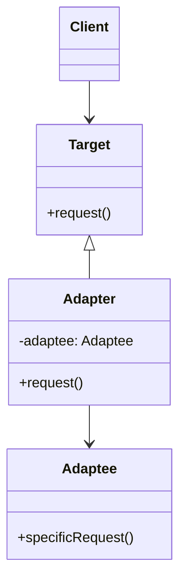
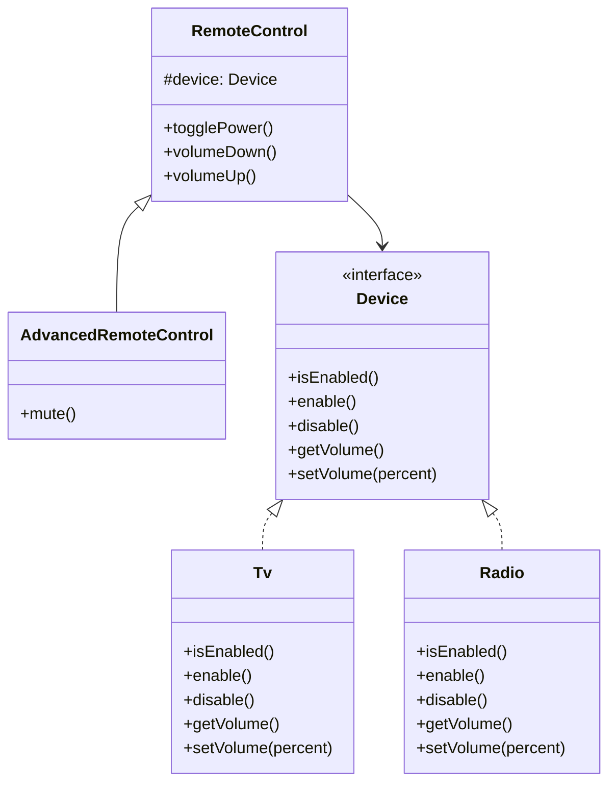
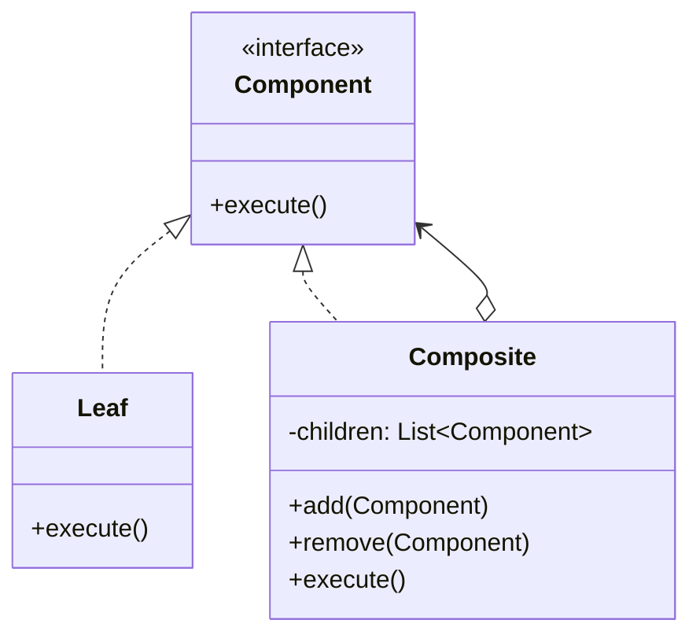
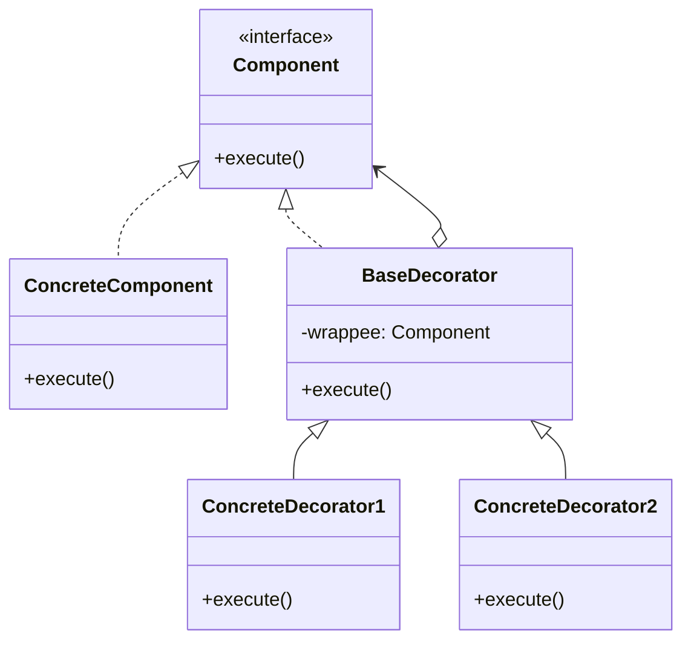
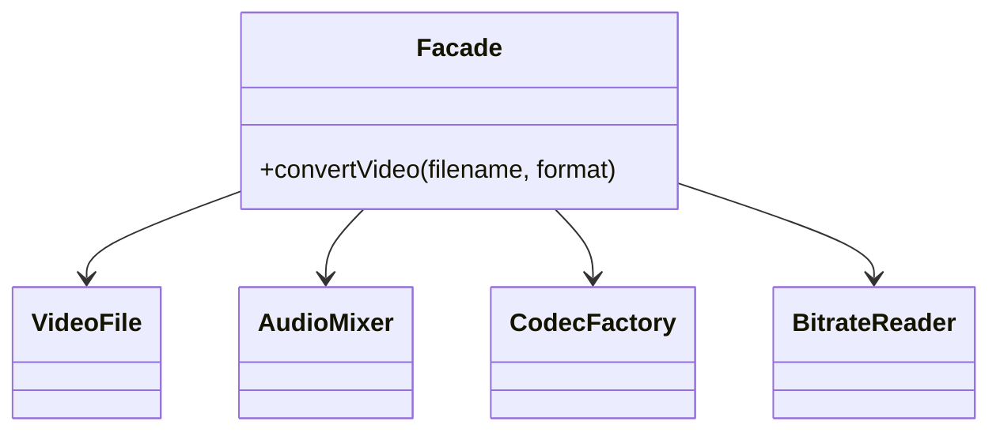
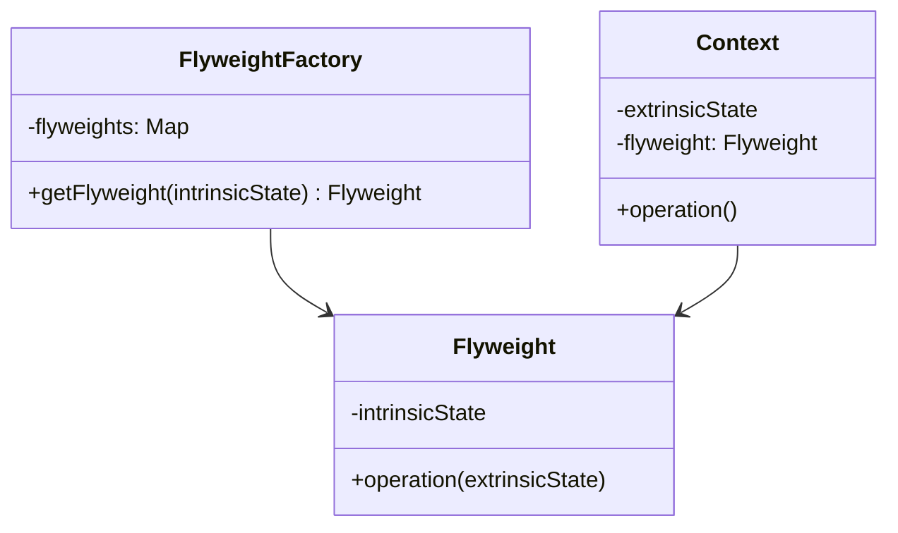
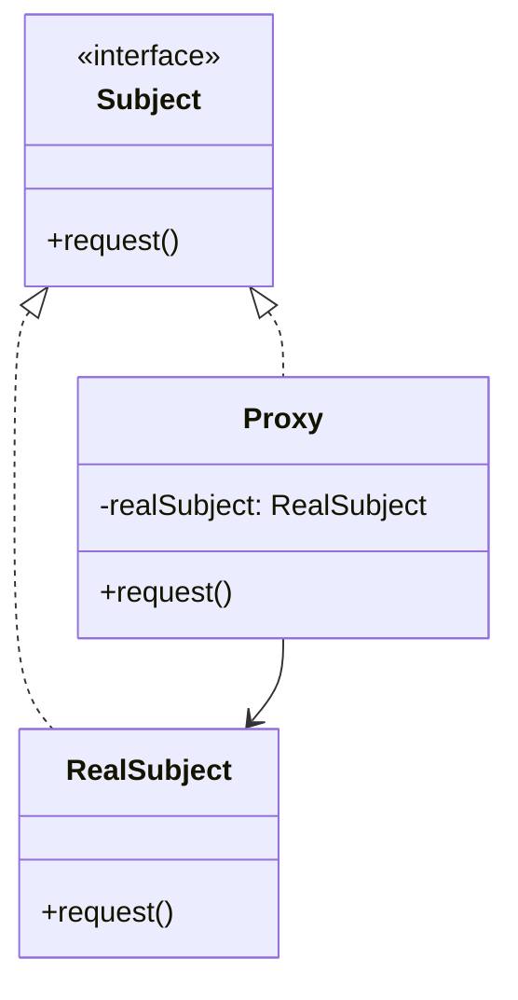

# Các Mẫu Thiết Kế Cấu Trúc (Structural Design Patterns)

Nhóm mẫu cấu trúc (Structural Patterns) tập trung vào việc lắp ghép các đối tượng và lớp thành một cấu trúc lớn hơn, đồng thời giữ cho cấu trúc này linh hoạt và hiệu quả.

---

## 1. Adapter

### Khái niệm
**Adapter** (còn gọi là **Wrapper**) là mẫu thiết kế cho phép các đối tượng có giao diện không tương thích có thể hoạt động chung với nhau thông qua một lớp trung gian (adapter) chuyển đổi giao diện này sang giao diện kia.



### Khi nào áp dụng?
*   Khi bạn muốn sử dụng một class có sẵn nhưng interface của nó không tương thích với phần còn lại của dự án.
*   Khi bạn muốn tái sử dụng một số lớp con có sẵn nhưng chúng thiếu một số tính năng chung và bạn không thể sửa đổi lớp cha của chúng.

### Ưu & Nhược điểm
*   **Ưu điểm**:
    *   *Single Responsibility Principle*: Bạn có thể tách biệt code chuyển đổi giao diện ra khỏi logic nghiệp vụ chính.
    *   *Open/Closed Principle*: Dễ dàng giới thiệu các adapter mới mà không làm ảnh hưởng đến mã nguồn client hiện tại.
*   **Nhược điểm**:
    *   Độ phức tạp tăng lên vì bạn cần viết thêm các class và interface trung gian.

### Ví dụ Code TypeScript
Tích hợp cổng thanh toán bên thứ ba (PayPal) có giao thức thanh toán khác biệt vào hệ thống thanh toán hiện tại của bạn.

```typescript
// Giao diện thanh toán hiện tại của hệ thống (Target Interface)
interface ModernPaymentProcessor {
    pay(amountInVND: number): string;
}

// Cổng thanh toán nội bộ đã tuân thủ interface chuẩn (Concrete Target)
class LocalBankProcessor implements ModernPaymentProcessor {
    public pay(amountInVND: number): string {
        return `Thực hiện thanh toán ${amountInVND} VND qua cổng Ngân Hàng nội địa.`;
    }
}

// Lớp dịch vụ của bên thứ ba không tương thích (Adaptee)
// Lớp này nhận thanh toán bằng USD thay vì VND và dùng phương thức sendPayment() thay vì pay()
class PayPalAPI {
    public sendPayment(amountInUSD: number): string {
        return `Thành công! Đã gửi ${amountInUSD} USD qua PayPal.`;
    }
}

// Lớp Adapter chuyển đổi từ PayPalAPI sang ModernPaymentProcessor
class PayPalAdapter implements ModernPaymentProcessor {
    private payPalAPI: PayPalAPI;
    private exchangeRate: number;

    constructor(payPalAPI: PayPalAPI) {
        this.payPalAPI = payPalAPI;
        this.exchangeRate = 25000; // Tỷ giá giả định 1 USD = 25,000 VND
    }

    public pay(amountInVND: number): string {
        // Chuyển đổi VND sang USD
        const amountInUSD = amountInVND / this.exchangeRate;
        // Gọi phương thức đặc thù của PayPalAPI
        return this.payPalAPI.sendPayment(Number(amountInUSD.toFixed(2)));
    }
}

// --- KHÁCH HÀNG SỬ DỤNG ---
function checkout(paymentProcessor: ModernPaymentProcessor, totalAmount: number): void {
    console.log(paymentProcessor.pay(totalAmount));
}

const localPayment = new LocalBankProcessor();
checkout(localPayment, 500000); // 500,000 VND

const payPalService = new PayPalAPI();
const payPalAdapter = new PayPalAdapter(payPalService);
checkout(payPalAdapter, 500000); // 500,000 VND (Sẽ chuyển thành 20 USD)
```

---

## 2. Bridge

### Khái niệm
**Bridge** là mẫu thiết kế giúp phân chia một lớp lớn hoặc tập hợp các lớp liên quan chặt chẽ thành hai phân cấp độc lập: **Abstraction** (Lớp Trừu tượng/Giao diện người dùng) và **Implementation** (Lớp Thực thi/Nghiệp vụ bên dưới), giúp chúng có thể phát triển độc lập với nhau.



### Khi nào áp dụng?
*   Khi bạn muốn chia nhỏ và mở rộng một lớp chứa nhiều biến thể của một tính năng (ví dụ: nếu bạn làm việc với nhiều máy chủ cơ sở dữ liệu và nhiều kiểu hiển thị dữ liệu).
*   Khi bạn muốn thay đổi các phần thực thi (implementation) ở thời gian chạy (runtime) mà không cần biên dịch lại mã nguồn abstraction.

### Ưu & Nhược điểm
*   **Ưu điểm**:
    *   Giúp mã nguồn độc lập với các nền tảng/thiết bị cụ thể.
    *   Code client hoạt động với các abstraction mức cao, không bị ảnh hưởng bởi chi tiết thực thi mức thấp.
    *   *Open/Closed Principle*: Bạn có thể phát triển các abstraction và implementation độc lập.
*   **Nhược điểm**:
    *   Làm tăng độ phức tạp của code đối với các chương trình nhỏ, do phải phân tách lớp.

### Ví dụ Code TypeScript
Điều khiển từ xa (Remote Controls - Abstraction) điều khiển các thiết bị điện tử khác nhau như TV và Radio (Devices - Implementation).

```typescript
// --- IMPLEMENTATION (GIAO DIỆN THIẾT BỊ) ---
interface Device {
    isEnabled(): boolean;
    enable(): void;
    disable(): void;
    getVolume(): number;
    setVolume(percent: number): void;
    getName(): string;
}

// Lớp thực thi cụ thể cho TV
class TV implements Device {
    private power: boolean = false;
    private volume: number = 30;

    public isEnabled(): boolean { return this.power; }
    public enable(): void { this.power = true; }
    public disable(): void { this.power = false; }
    public getVolume(): number { return this.volume; }
    public setVolume(percent: number): void { this.volume = percent; }
    public getName(): string { return "Tivi phòng khách"; }
}

// Lớp thực thi cụ thể cho Radio
class Radio implements Device {
    private power: boolean = false;
    private volume: number = 20;

    public isEnabled(): boolean { return this.power; }
    public enable(): void { this.power = true; }
    public disable(): void { this.power = false; }
    public getVolume(): number { return this.volume; }
    public setVolume(percent: number): void { this.volume = percent; }
    public getName(): string { return "Đài Radio cổ điển"; }
}

// --- ABSTRACTION (ĐIỀU KHIỂN CƠ BẢN) ---
class RemoteControl {
    protected device: Device;

    constructor(device: Device) {
        this.device = device;
    }

    public togglePower(): void {
        if (this.device.isEnabled()) {
            this.device.disable();
            console.log(`${this.device.getName()}: Đã TẮT.`);
        } else {
            this.device.enable();
            console.log(`${this.device.getName()}: Đã BẬT.`);
        }
    }

    public volumeDown(): void {
        const current = this.device.getVolume();
        this.device.setVolume(Math.max(0, current - 10));
        console.log(`${this.device.getName()}: Âm lượng giảm xuống ${this.device.getVolume()}%`);
    }

    public volumeUp(): void {
        const current = this.device.getVolume();
        this.device.setVolume(Math.min(100, current + 10));
        console.log(`${this.device.getName()}: Âm lượng tăng lên ${this.device.getVolume()}%`);
    }
}

// Mở rộng Abstraction: Điều khiển từ xa cao cấp hơn (Advanced Abstraction)
class AdvancedRemoteControl extends RemoteControl {
    public mute(): void {
        this.device.setVolume(0);
        console.log(`${this.device.getName()}: Đã tắt tiếng (Mute).`);
    }
}

// --- KHÁCH HÀNG SỬ DỤNG ---
const tv = new TV();
const remote = new RemoteControl(tv);
remote.togglePower();
remote.volumeUp();

console.log("");

const radio = new Radio();
const advancedRemote = new AdvancedRemoteControl(radio);
advancedRemote.togglePower();
advancedRemote.volumeDown();
advancedRemote.mute();
```

---

## 3. Composite

### Khái niệm
**Composite** là mẫu thiết kế cấu trúc cho phép bạn nhóm các đối tượng vào cấu trúc cây để biểu diễn mối quan hệ phân cấp "một phần - toàn bộ" (part-whole hierarchies). Mẫu này giúp client làm việc với các đối tượng riêng lẻ và các nhóm đối tượng một cách đồng nhất.



### Khi nào áp dụng?
*   Khi bạn cần xây dựng các cấu trúc đối tượng dạng cây phân cấp (như danh mục sản phẩm, cấu trúc phòng ban, hoặc hệ thống tệp tin/thư mục).
*   Khi bạn muốn mã nguồn client đối xử bình đẳng giữa các phần tử đơn lẻ (Leaf) và các thùng chứa nhóm phần tử (Composite).

### Ưu & Nhược điểm
*   **Ưu điểm**:
    *   Giúp mã nguồn client đơn giản hơn vì có thể dùng một interface chung để tương tác với mọi đối tượng trong cây.
    *   *Open/Closed Principle*: Dễ dàng thêm các loại phần tử mới vào cấu trúc cây mà không làm hỏng code hiện tại.
*   **Nhược điểm**:
    *   Có thể khó khăn khi muốn áp đặt các ràng buộc lên các lớp con cụ thể trong cây (ví dụ: chỉ cho phép một số loại Leaf nhất định nằm trong một Composite cụ thể).

### Ví dụ Code TypeScript
Xây dựng cấu trúc thư mục chứa các tệp tin (File System) và tính toán tổng dung lượng.

```typescript
// Lớp cơ sở chung cho mọi phần tử trong hệ thống tệp tin (Component)
abstract class FileSystemNode {
    public name: string;

    constructor(name: string) {
        this.name = name;
    }

    public abstract getSize(): number;
    public abstract print(indent?: string): void;
}

// Đối tượng đơn lẻ đại diện cho tệp tin (Leaf)
class FileNode extends FileSystemNode {
    private size: number;

    constructor(name: string, size: number) {
        super(name);
        this.size = size;
    }

    public getSize(): number {
        return this.size;
    }

    public print(indent: string = ""): void {
        console.log(`${indent}📄 ${this.name} (${this.size} KB)`);
    }
}

// Đối tượng chứa tập hợp đại diện cho thư mục (Composite)
class DirectoryNode extends FileSystemNode {
    private children: FileSystemNode[];

    constructor(name: string) {
        super(name);
        this.children = [];
    }

    public add(node: FileSystemNode): void {
        this.children.push(node);
    }

    public remove(node: FileSystemNode): void {
        this.children = this.children.filter(child => child !== node);
    }

    public getSize(): number {
        // Đệ quy tính tổng dung lượng các tệp và thư mục con
        return this.children.reduce((total, child) => total + child.getSize(), 0);
    }

    public print(indent: string = ""): void {
        console.log(`${indent}📁 [Thư mục] ${this.name} (Tổng: ${this.getSize()} KB)`);
        this.children.forEach(child => child.print(indent + "  "));
    }
}

// --- KHÁCH HÀNG SỬ DỤNG ---
const rootDir = new DirectoryNode("root");
const musicDir = new DirectoryNode("Music");
const docsDir = new DirectoryNode("Documents");

const song1 = new FileNode("yesterday.mp3", 4000); // 4MB
const song2 = new FileNode("let-it-be.mp3", 5000); // 5MB
musicDir.add(song1);
musicDir.add(song2);

const resume = new FileNode("resume.pdf", 500);
const photo = new FileNode("avatar.png", 1500);
docsDir.add(resume);

rootDir.add(musicDir);
rootDir.add(docsDir);
rootDir.add(photo);

// In ra toàn bộ sơ đồ cây
rootDir.print();
```

---

## 4. Decorator

### Khái niệm
**Decorator** (còn gọi là **Wrapper**) là mẫu thiết kế cấu trúc cho phép gán thêm các hành vi mới cho một đối tượng một cách động bằng cách bọc đối tượng đó bên trong các đối tượng wrapper đặc biệt.



### Khi nào áp dụng?
*   Khi bạn muốn gán thêm hoặc gỡ bỏ các trách nhiệm, hành vi của một đối tượng tại thời điểm chạy (runtime) mà không làm ảnh hưởng đến các đối tượng khác.
*   Khi việc kế thừa lớp (inheritance) để mở rộng chức năng trở nên không khả thi hoặc tạo ra quá nhiều lớp con trùng lặp (class explosion).

### Ưu & Nhược điểm
*   **Ưu điểm**:
    *   Linh hoạt hơn kế thừa rất nhiều. Bạn có thể kết hợp nhiều hành vi bằng cách lồng nhiều decorator chồng lên nhau.
    *   *Single Responsibility Principle*: Bạn có thể chia nhỏ một lớp thực hiện quá nhiều tính năng thành nhiều lớp trang trí đơn giản.
*   **Nhược điểm**:
    *   Rất khó để gỡ bỏ một decorator cụ thể nằm sâu trong chuỗi bọc (wrapper stack).
    *   Có thể gây khó hiểu khi debug do cấu trúc bọc lồng nhau sâu sắc.

### Ví dụ Code TypeScript
Hệ thống gửi thông báo (Notification Service). Bắt đầu với thông báo Email cơ bản, sau đó có thể "trang trí" thêm tính năng gửi SMS, Slack hoặc Facebook.

```typescript
// Giao diện thông báo cơ sở (Component)
interface NotificationService {
    send(message: string): string;
}

// Đối tượng thông báo cơ bản qua email (ConcreteComponent)
class EmailNotification implements NotificationService {
    public send(message: string): string {
        return `📧 [Email] Gửi thư điện tử: "${message}"`;
    }
}

// Lớp Decorator cơ sở (BaseDecorator)
abstract class NotificationDecorator implements NotificationService {
    protected wrappee: NotificationService;

    constructor(wrappee: NotificationService) {
        this.wrappee = wrappee;
    }

    public send(message: string): string {
        return this.wrappee.send(message);
    }
}

// Decorator cụ thể 1: Gửi thêm SMS
class SMSDecorator extends NotificationDecorator {
    public send(message: string): string {
        // Thực hiện hành động của các tầng bên trong trước, sau đó bổ sung hành động của mình
        return `${super.send(message)}\n📱 [SMS] Gửi tin nhắn điện thoại: "${message}"`;
    }
}

// Decorator cụ thể 2: Gửi thêm Slack
class SlackDecorator extends NotificationDecorator {
    public send(message: string): string {
        return `${super.send(message)}\n💬 [Slack] Gửi tin nhắn kênh Slack: "${message}"`;
    }
}

// --- KHÁCH HÀNG SỬ DỤNG ---
// Khởi đầu với chỉ Email
let notifyStack: NotificationService = new EmailNotification();

// Trang trí thêm tính năng gửi qua SMS
notifyStack = new SMSDecorator(notifyStack);

// Trang trí tiếp tục qua Slack
notifyStack = new SlackDecorator(notifyStack);

console.log("--- Bắt đầu gửi hệ thống thông báo đa kênh ---");
const result = notifyStack.send("Hệ thống phát hiện lỗi đăng nhập bất thường!");
console.log(result);
```

---

## 5. Facade

### Khái niệm
**Facade** là mẫu thiết kế cấu trúc cung cấp một giao diện đơn giản hóa (giao diện mặt tiền) cho một thư viện, một framework hoặc bất kỳ hệ thống phức tạp nào gồm nhiều lớp.



### Khi nào áp dụng?
*   Khi bạn muốn cung cấp một giao diện tối giản cho một hệ thống con (subsystem) phức tạp.
*   Khi bạn muốn cấu trúc một hệ thống con thành các tầng (layers) độc lập và giao tiếp qua các Facade của mỗi tầng.

### Ưu & Nhược điểm
*   **Ưu điểm**:
    *   Cách ly mã nguồn của bạn khỏi sự phức tạp của một thư viện bên thứ ba hoặc một subsystem lớn.
*   **Nhược điểm**:
    *   Một Facade có thể biến thành một đối tượng "vạn năng" (god object) kết nối trực tiếp đến mọi lớp trong chương trình.

### Ví dụ Code TypeScript
Giả lập hệ thống rạp phim tại nhà (Home Theater Facade) điều khiển các thiết bị phức tạp như Đèn, Máy chiếu, Âm thanh và Đầu đĩa.

```typescript
// Các lớp con phức tạp bên trong hệ thống
class Amplifier {
    public on(): void { console.log("Bật Âm Ly."); }
    public setVolume(level: number): void { console.log(`Cài đặt âm lượng âm ly ở mức: ${level}`); }
    public off(): void { console.log("Tắt Âm Ly."); }
}

class Projector {
    public on(): void { console.log("Bật máy chiếu."); }
    public wideScreenMode(): void { console.log("Thiết lập tỷ lệ khung hình rộng 16:9."); }
    public off(): void { console.log("Tắt máy chiếu."); }
}

class TheaterLights {
    public dim(level: number): void { console.log(`Giảm độ sáng đèn phòng xuống: ${level}%`); }
    public on(): void { console.log("Bật đèn phòng."); }
}

class DVDPlayer {
    public on(): void { console.log("Bật đầu đĩa DVD."); }
    public play(movie: string): void { console.log(`Bắt đầu phát phim: "${movie}"`); }
    public stop(): void { console.log("Dừng phát phim."); }
    public off(): void { console.log("Tắt đầu đĩa DVD."); }
}

// Lớp Facade cung cấp giao diện đơn giản nhất
class HomeTheaterFacade {
    private amp: Amplifier;
    private projector: Projector;
    private lights: TheaterLights;
    private dvd: DVDPlayer;

    constructor(amp: Amplifier, projector: Projector, lights: TheaterLights, dvd: DVDPlayer) {
        this.amp = amp;
        this.projector = projector;
        this.lights = lights;
        this.dvd = dvd;
    }

    public watchMovie(movie: string): void {
        console.log(`--- Chuẩn bị chiếu phim: ${movie} ---`);
        this.lights.dim(10);
        this.projector.on();
        this.projector.wideScreenMode();
        this.amp.on();
        this.amp.setVolume(20);
        this.dvd.on();
        this.dvd.play(movie);
    }

    public endMovie(): void {
        console.log("\n--- Tắt hệ thống chiếu phim ---");
        this.lights.on();
        this.projector.off();
        this.amp.off();
        this.dvd.stop();
        this.dvd.off();
    }
}

// --- KHÁCH HÀNG SỬ DỤNG ---
const amp = new Amplifier();
const projector = new Projector();
const lights = new TheaterLights();
const dvd = new DVDPlayer();

// Sử dụng Facade để thao tác dễ dàng thay vì gọi hàng chục hàm lẻ tẻ
const homeTheater = new HomeTheaterFacade(amp, projector, lights, dvd);
homeTheater.watchMovie("Inception");
homeTheater.endMovie();
```

---

## 6. Flyweight

### Khái niệm
**Flyweight** (còn gọi là **Cache**) là mẫu thiết kế cấu trúc giúp tối ưu hóa dung lượng bộ nhớ (RAM) bằng cách chia sẻ các phần trạng thái chung (trạng thái nội tại - Intrinsic State) giữa nhiều đối tượng thay vì lưu giữ riêng rẽ ở mỗi đối tượng.



### Khi nào áp dụng?
*   Khi chương trình cần tạo ra số lượng cực lớn đối tượng (hàng trăm ngàn đối tượng) dẫn đến nguy cơ cạn kiệt bộ nhớ RAM.
*   Khi phần lớn trạng thái của đối tượng có thể tách biệt thành trạng thái ngoại tại (Extrinsic State - phụ thuộc vào ngữ cảnh và thay đổi liên tục) và trạng thái nội tại (Intrinsic State - tĩnh và giống nhau giữa nhiều đối tượng).

### Ưu & Nhược điểm
*   **Ưu điểm**:
    *   Tiết kiệm lượng lớn bộ nhớ RAM nếu chương trình của bạn chứa hàng nghìn đối tượng tương tự nhau.
*   **Nhược điểm**:
    *   Đánh đổi bằng tốc độ CPU do phải thực hiện tra cứu Flyweight liên tục.
    *   Làm phức tạp thiết kế mã nguồn vì phải tách rời trạng thái của đối tượng.

### Ví dụ Code TypeScript
Trò chơi bắn súng góc nhìn thứ nhất (FPS) vẽ hàng ngàn viên đạn trên màn hình. Mỗi loại đạn có tên, màu sắc, hình ảnh (nặng, tốn RAM - Intrinsic) nhưng tọa độ và tốc độ bay của mỗi viên đạn là khác nhau (nhẹ - Extrinsic).

```typescript
// Flyweight Class: Lưu trữ dữ liệu chung, dùng chung cho nhiều đối tượng
class BulletType {
    private name: string;
    private color: string;
    private sprite: string; // giả lập một file hình ảnh đồ họa nặng

    constructor(name: string, color: string, sprite: string) {
        this.name = name;
        this.color = color;
        this.sprite = sprite;
    }

    public draw(x: number, y: number, speed: number): void {
        console.log(`Vẽ đạn [${this.name}] màu [${this.color}] tại tọa độ (${x}, ${y}) đang bay với tốc độ ${speed}m/s`);
    }
}

// Flyweight Factory: Quản lý và tái sử dụng các BulletType
class BulletFactory {
    private bulletTypes: Map<string, BulletType> = new Map();

    public getBulletType(name: string, color: string, sprite: string): BulletType {
        const key = `${name}_${color}`;
        if (!this.bulletTypes.has(key)) {
            console.log(`[Tạo mới Flyweight] Khởi tạo loại đạn mới: ${name}`);
            this.bulletTypes.set(key, new BulletType(name, color, sprite));
        } else {
            console.log(`[Tái sử dụng Flyweight] Tìm thấy loại đạn có sẵn: ${name}`);
        }
        return this.bulletTypes.get(key)!;
    }
}

// Context Class: Lưu dữ liệu riêng biệt và tham chiếu tới Flyweight
class Bullet {
    private x: number;
    private y: number;
    private speed: number;
    private bulletType: BulletType; // Tham chiếu đến Flyweight chung

    constructor(x: number, y: number, speed: number, bulletType: BulletType) {
        this.x = x;
        this.y = y;
        this.speed = speed;
        this.bulletType = bulletType;
    }

    public draw(): void {
        this.bulletType.draw(this.x, this.y, this.speed);
    }
}

// --- KHÁCH HÀNG SỬ DỤNG ---
const factory = new BulletFactory();
const activeBullets: Bullet[] = [];

function shoot(x: number, y: number, speed: number, name: string, color: string, sprite: string): void {
    const type = factory.getBulletType(name, color, sprite);
    const bullet = new Bullet(x, y, speed, type);
    activeBullets.push(bullet);
}

// Bắn 4 viên đạn nhưng thực chất chỉ tạo 2 loại đạn lưu trong RAM
shoot(10, 20, 100, "9mm", "Bạc", "image_9mm.png");
shoot(15, 25, 100, "9mm", "Bạc", "image_9mm.png");
shoot(20, 30, 200, "Shotgun Shell", "Đỏ", "image_shotgun.png");
shoot(25, 35, 200, "Shotgun Shell", "Đỏ", "image_shotgun.png");

console.log(`\nTổng số viên đạn trên màn hình: ${activeBullets.length}`);
// Sử dụng ép kiểu tạm thời hoặc lấy map size từ factory thông qua phương thức/biến thích hợp
// Ở đây chúng ta truy cập trực tiếp biến private trong ngữ cảnh demo
console.log(`Tổng số đối tượng Flyweight (BulletType) thực sự trong RAM: ${(factory as any).bulletTypes.size}`);
```

---

## 7. Proxy

### Khái niệm
**Proxy** là mẫu thiết kế cấu trúc cung cấp một đối tượng thay thế hoặc giữ chỗ cho một đối tượng khác để kiểm soát quyền truy cập, thực hiện ghi log, kiểm tra bảo mật hoặc thực hiện cơ chế lưu đệm (caching) trước khi yêu cầu được gửi tới đối tượng gốc.



### Khi nào áp dụng?
*   **Lazy initialization (Virtual Proxy)**: Trì hoãn việc khởi tạo một đối tượng dịch vụ nặng cho đến khi nó thực sự được dùng.
*   **Access control (Protection Proxy)**: Kiểm tra quyền hạn của client trước khi cho phép truy cập đối tượng gốc.
*   **Caching (Cache Proxy)**: Lưu trữ kết quả của các tác vụ tốn kém để dùng lại nhanh chóng.
*   **Logging (Logging Proxy)**: Ghi lại thông tin lịch sử cuộc gọi trước khi chuyển tiếp yêu cầu đến đối tượng gốc.

### Ưu & Nhược điểm
*   **Ưu điểm**:
    *   Bạn có thể kiểm soát đối tượng dịch vụ mà khách hàng không hề biết.
    *   Quản lý vòng đời của đối tượng dịch vụ khi khách hàng không quan tâm đến nó.
    *   Proxy hoạt động ngay cả khi đối tượng dịch vụ chưa sẵn sàng hoặc không tồn tại.
    *   *Open/Closed Principle*: Dễ dàng thêm các proxy mới mà không cần sửa đổi dịch vụ gốc hoặc client.
*   **Nhược điểm**:
    *   Mã nguồn trở nên phức tạp vì phải bổ sung thêm các lớp trung gian.
    *   Phản hồi từ dịch vụ gốc có thể bị chậm trễ một chút do đi qua tầng Proxy.

### Ví dụ Code TypeScript
Xây dựng một proxy lưu đệm (Caching Proxy) cho một dịch vụ truy cập API từ xa (giả lập việc tải dữ liệu từ YouTube).

```typescript
// Giao diện chung (Interface)
interface ThirdPartyYouTubeLib {
    getVideoInfo(id: string): string;
}

// Đối tượng thực tế (Real Service) - Thực hiện việc gọi API nặng và tốn thời gian
class ThirdPartyYouTubeClass implements ThirdPartyYouTubeLib {
    public getVideoInfo(id: string): string {
        console.log(`[API] Đang tải thông tin video từ YouTube cho ID: "${id}"...`);
        // Giả lập thời gian tải tốn kém
        return `Video Content for [${id}]`;
    }
}

// Đối tượng Proxy - Kiểm tra cache trước khi gọi Real Service
class CachedYouTubeProxy implements ThirdPartyYouTubeLib {
    private service: ThirdPartyYouTubeLib;
    private cache: Map<string, string>; // Lưu cache theo ID video

    constructor(service: ThirdPartyYouTubeLib) {
        this.service = service;
        this.cache = new Map();
    }

    public getVideoInfo(id: string): string {
        if (!this.cache.has(id)) {
            // Nếu không có trong cache, gọi dịch vụ gốc để lấy dữ liệu
            const result = this.service.getVideoInfo(id);
            this.cache.set(id, result);
        } else {
            console.log(`[Cache Proxy] Tìm thấy thông tin video "${id}" trong Cache. Không cần tải lại!`);
        }
        return this.cache.get(id)!;
    }
}

// --- KHÁCH HÀNG SỬ DỤNG ---
const youtubeService = new ThirdPartyYouTubeClass();
const youtubeProxy = new CachedYouTubeProxy(youtubeService);

console.log("--- Lần gọi thứ nhất (Không có cache) ---");
console.log(youtubeProxy.getVideoInfo("design-patterns-101"));

console.log("\n--- Lần gọi thứ hai (Đã có cache) ---");
console.log(youtubeProxy.getVideoInfo("design-patterns-101")); // Trả về ngay lập tức từ proxy cache
```
